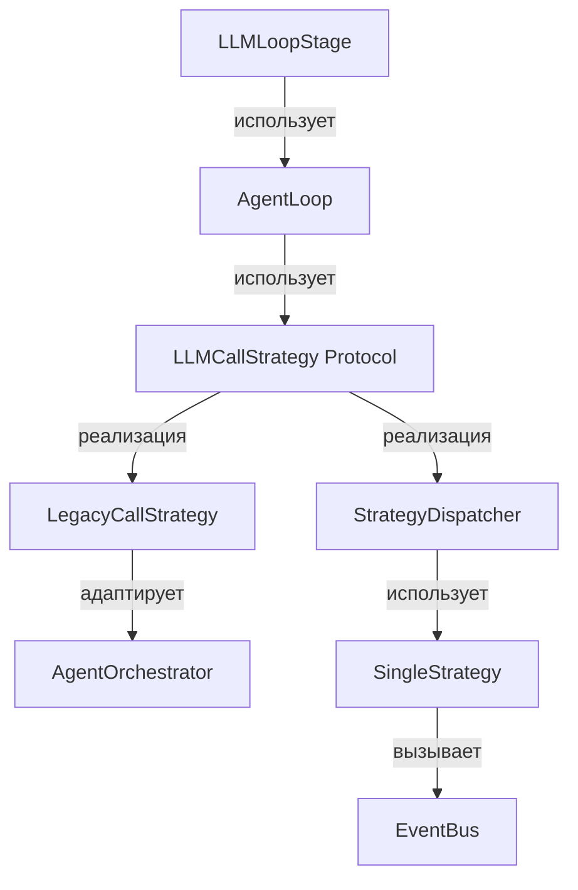

# Design: AgentLoop Refactoring

## Проблема

Текущая архитектура `LLMLoopStage` имеет следующие проблемы:

1. **Нарушение SRP** — один класс отвечает за цикл, вызов LLM, tool-calling, permission
2. **Дублирование** — `_run_llm_loop` и `_process_via_event_bus` дублируют логику
3. **Неполная реализация** — `_process_via_event_bus` не имеет цикла итераций
4. **Нарушение OCP** — добавление стратегии требует изменения LLMLoopStage
5. **Несоответствие ACP** — `max_iterations` вместо `max_turn_requests`

## Решение

### Архитектура



### Компоненты

#### 1. `StopReason` enum

**Файл:** `codelab/src/codelab/server/protocol/stop_reasons.py`

```python
from enum import StrEnum

class StopReason(StrEnum):
    """Причины остановки prompt turn (ACP 05-Prompt Turn.md)."""
    
    END_TURN = "end_turn"
    MAX_TOKENS = "max_tokens"
    MAX_TURN_REQUESTS = "max_turn_requests"
    REFUSAL = "refusal"
    CANCELLED = "cancelled"
```

**Обоснование:** ACP спецификация определяет 5 stop reasons. Использование enum обеспечивает type safety и соответствие протоколу.

---

#### 2. `LLMCallStrategy` Protocol

**Файл:** `codelab/src/codelab/server/agent/strategies/base.py`

```python
from typing import Protocol, Any

class LLMCallStrategy(Protocol):
    """Интерфейс для стратегии вызова LLM.
    
    Следующий принцип Dependency Inversion:
    AgentLoop зависит от абстракции, не от конкретной реализации.
    """
    
    async def execute(
        self,
        session: "SessionState",
        prompt: str | None,
        mcp_manager: Any | None = None,
    ) -> "AgentResponse":
        """Выполнить вызов LLM с начальным prompt.
        
        Args:
            session: Состояние сессии
            prompt: Текст промпта (None для продолжения)
            mcp_manager: MCP manager для tool execution
        
        Returns:
            AgentResponse с текстом, tool_calls, usage
        """
        ...
    
    async def continue_execution(
        self,
        session: "SessionState",
        mcp_manager: Any | None = None,
    ) -> "AgentResponse":
        """Продолжить выполнение после tool_results.
        
        Tool results уже находятся в session.history.
        Стратегия должна передать их LLM для продолжения диалога.
        
        Args:
            session: Состояние сессии (с tool_results в history)
            mcp_manager: MCP manager для tool execution
        
        Returns:
            AgentResponse с текстом, tool_calls, usage
        """
        ...
```

**Обоснование:** Protocol позволяет использовать duck typing без явного наследования. Обе существующие стратегии (LegacyCallStrategy и StrategyDispatcher) уже имеют нужные методы.

---

#### 3. `LegacyCallStrategy`

**Файл:** `codelab/src/codelab/server/agent/strategies/legacy_adapter.py`

```python
class LegacyCallStrategy:
    """Адаптер AgentOrchestrator под LLMCallStrategy.
    
    Сохраняет legacy путь (AgentOrchestrator + NaiveAgent)
    для обратной совместимости.
    
    Pattern: Adapter
    """
    
    def __init__(self, orchestrator: AgentOrchestrator):
        self._orchestrator = orchestrator
    
    async def execute(self, session, prompt, mcp_manager=None):
        """Первый вызов — process_prompt."""
        return await self._orchestrator.process_prompt(
            session, prompt, mcp_manager
        )
    
    async def continue_execution(self, session, mcp_manager=None):
        """Продолжение — continue_with_tool_results."""
        return await self._orchestrator.continue_with_tool_results(
            session, [], mcp_manager
        )
```

**Обоснование:** Adapter pattern позволяет использовать существующий AgentOrchestrator без изменений.

---

#### 4. Адаптация `StrategyDispatcher`

**Файл:** `codelab/src/codelab/server/agent/strategies/dispatcher.py`

StrategyDispatcher уже реализует нужный интерфейс. Нужно:
- Убедиться что сигнатуры совпадают с Protocol
- Добавить type hints

```python
class StrategyDispatcher:
    """Диспетчер стратегий выполнения.
    
    Реализует LLMCallStrategy Protocol.
    """
    
    async def execute(
        self,
        session: SessionState,
        prompt: str | None,
        mcp_manager: Any | None = None,
    ) -> AgentResponse:
        """Выполнить стратегию."""
        # Определить агента из session.config_values["_agent"]
        agent_name = self._resolve_agent_name(session)
        
        # Получить стратегию
        strategy = self._strategies.get(self._strategy_name)
        
        # Выполнить с правильным agent_name
        return await strategy.execute(
            session=session,
            prompt=prompt,
            mcp_manager=mcp_manager,
            agent_name=agent_name,
        )
    
    async def continue_execution(
        self,
        session: SessionState,
        mcp_manager: Any | None = None,
    ) -> AgentResponse:
        """Продолжить выполнение."""
        agent_name = self._resolve_agent_name(session)
        strategy = self._strategies.get(self._strategy_name)
        
        return await strategy.continue_execution(
            session=session,
            mcp_manager=mcp_manager,
            agent_name=agent_name,
        )
```

---

#### 5. `AgentLoop`

**Файл:** `codelab/src/codelab/server/protocol/handlers/pipeline/stages/agent_loop.py`

```python
@dataclass
class AgentLoopResult:
    """Результат выполнения AgentLoop."""
    text: str | None = None
    stop_reason: StopReason = StopReason.END_TURN
    notifications: list[ACPMessage] = field(default_factory=list)
    pending_permission: bool = False
    pending_tool_calls: list[str] = field(default_factory=list)
    tool_results: list[ToolResult] = field(default_factory=list)


class AgentLoop:
    """Универсальный цикл итераций LLM tool-calling.
    
    Соответствует ACP 05-Prompt Turn.md:
    - loop Until completion (строка 30)
    - max_turn_requests stop reason (строка 277-279)
    - Tool results back to LLM (строки 261-263)
    
    Responsibilities:
    - Цикл итераций (max_turn_requests)
    - Вызов LLM через LLMCallStrategy
    - Обработка tool_calls
    - Permission pause/resume
    - Cancellation handling
    
    НЕ отвечает за:
    - Вызов LLM (делает LLMCallStrategy)
    - Выполнение tools (делает ToolRegistry)
    - Pipeline integration (делает LLMLoopStage)
    """
    
    def __init__(
        self,
        strategy: LLMCallStrategy,
        tool_registry: ToolRegistry,
        tool_call_handler: ToolCallHandler,
        permission_manager: PermissionManager,
        state_manager: StateManager,
        content_extractor: ContentExtractor,
        content_formatter: ContentFormatter,
        replay_manager: ReplayManager,
        plan_builder: PlanBuilder,
        max_turn_requests: int = 10,
    ):
        self._strategy = strategy
        self._tool_registry = tool_registry
        self._tool_call_handler = tool_call_handler
        self._permission_manager = permission_manager
        self._state_manager = state_manager
        self._content_extractor = content_extractor
        self._content_formatter = content_formatter
        self._replay_manager = replay_manager
        self._plan_builder = plan_builder
        self._max_turn_requests = max_turn_requests
    
    async def run(
        self,
        session: SessionState,
        session_id: str,
        initial_prompt: str | None = None,
        mcp_manager: Any | None = None,
    ) -> AgentLoopResult:
        """Запустить цикл итераций.
        
        Flow:
        1. Вызов LLM (execute или continue_execution)
        2. Обработка ответа (text, tool_calls, plan)
        3. Если нет tool_calls → завершить
        4. Обработка tool_calls
        5. Если permission required → приостановить
        6. Продолжить цикл
        """
        notifications: list[ACPMessage] = []
        iteration = 0
        
        while iteration < self._max_turn_requests:
            iteration += 1
            
            # Проверка отмены
            if self._is_cancel_requested(session):
                return AgentLoopResult(
                    notifications=notifications,
                    stop_reason=StopReason.CANCELLED,
                )
            
            # Вызов LLM
            try:
                if iteration == 1 and initial_prompt:
                    response = await self._strategy.execute(
                        session, initial_prompt, mcp_manager
                    )
                else:
                    response = await self._strategy.continue_execution(
                        session, mcp_manager
                    )
            except Exception as e:
                logger.error("LLM call failed", session_id=session_id, error=str(e))
                notifications.append(_build_error_notification(session_id, str(e)))
                return AgentLoopResult(
                    notifications=notifications,
                    stop_reason=StopReason.END_TURN,
                )
            
            # Обработка ответа
            agent_text = response.text if response else ""
            has_tool_calls = response and response.tool_calls
            
            if agent_text:
                self._state_manager.add_assistant_message(session, agent_text)
                notifications.append(
                    _build_agent_response_notification(session_id, agent_text)
                )
            
            # Обработка plan
            plan = getattr(response, "plan", None)
            if plan:
                validated_plan = self._plan_builder.validate_plan_entries(plan)
                if validated_plan:
                    session.latest_plan = list(validated_plan)
                    notifications.append(
                        self._plan_builder.build_plan_notification(session_id, validated_plan)
                    )
            
            # Нет tool_calls → завершить
            if not has_tool_calls:
                return AgentLoopResult(
                    text=agent_text,
                    stop_reason=StopReason.END_TURN,
                    notifications=notifications,
                )
            
            # Обработка tool_calls
            tool_result = await self._process_tool_calls(
                session, session_id, response.tool_calls, notifications, mcp_manager
            )
            
            # Permission pause
            if tool_result.pending_permission:
                return AgentLoopResult(
                    notifications=notifications,
                    pending_permission=True,
                    pending_tool_calls=tool_result.pending_tool_calls,
                    tool_results=tool_result.tool_results,
                )
            
            # Отмена во время tool processing
            if self._is_cancel_requested(session):
                return AgentLoopResult(
                    notifications=notifications,
                    stop_reason=StopReason.CANCELLED,
                )
        
        # Max iterations reached
        logger.warning(
            "max_turn_requests reached",
            session_id=session_id,
            max_turn_requests=self._max_turn_requests,
        )
        return AgentLoopResult(
            notifications=notifications,
            stop_reason=StopReason.MAX_TURN_REQUESTS,
        )
    
    async def resume_after_permission(
        self,
        session: SessionState,
        session_id: str,
        tool_call_id: str,
        mcp_manager: Any | None = None,
    ) -> AgentLoopResult:
        """Продолжить цикл после permission approval.
        
        Flow:
        1. Выполнить pending tool
        2. Продолжить цикл через run()
        """
        # Выполнить pending tool
        tool_result = await self._execute_pending_tool(
            session, session_id, tool_call_id, mcp_manager
        )
        
        # Продолжить цикл (tool_results уже в session.history)
        return await self.run(
            session=session,
            session_id=session_id,
            initial_prompt=None,
            mcp_manager=mcp_manager,
        )
    
    async def _process_tool_calls(
        self,
        session: SessionState,
        session_id: str,
        tool_calls: list,
        notifications: list[ACPMessage],
        mcp_manager: Any | None,
    ) -> ToolProcessingResult:
        """Обработать tool calls из ответа LLM.
        
        Перенесено из LLMLoopStage._process_tool_calls_for_llm_loop.
        """
        # ... (существующая логика из llm_loop.py)
        pass
    
    async def _execute_pending_tool(
        self,
        session: SessionState,
        session_id: str,
        tool_call_id: str,
        mcp_manager: Any | None,
    ) -> ToolResult:
        """Выполнить pending tool после permission approval.
        
        Перенесено из LLMLoopStage.execute_pending_tool.
        """
        # ... (существующая логика из llm_loop.py)
        pass
    
    def _is_cancel_requested(self, session: SessionState) -> bool:
        """Проверить флаг отмены."""
        return (
            session.active_turn is not None
            and session.active_turn.cancel_requested
        )
```

---

#### 6. Рефакторинг `LLMLoopStage`

**Файл:** `codelab/src/codelab/server/protocol/handlers/pipeline/stages/llm_loop.py`

```python
class LLMLoopStage(PromptStage):
    """Тонкий адаптер pipeline → AgentLoop.
    
    Responsibilities:
    - Создание AgentLoop с нужной стратегией
    - Интеграция с pipeline (PromptContext → AgentLoopResult → PromptContext)
    
    НЕ отвечает за:
    - Цикл итераций (делает AgentLoop)
    - Вызов LLM (делает LLMCallStrategy)
    - Обработку tool_calls (делает AgentLoop)
    """
    
    def __init__(
        self,
        tool_registry: ToolRegistry,
        tool_call_handler: ToolCallHandler,
        permission_manager: PermissionManager,
        state_manager: StateManager,
        plan_builder: PlanBuilder,
        global_policy_manager: GlobalPolicyManager | None = None,
        strategy_dispatcher: StrategyDispatcher | None = None,
        tracer: Tracer | None = None,
    ):
        self._tool_registry = tool_registry
        self._tool_call_handler = tool_call_handler
        self._permission_manager = permission_manager
        self._state_manager = state_manager
        self._plan_builder = plan_builder
        self._global_policy_manager = global_policy_manager
        self._strategy_dispatcher = strategy_dispatcher
        self._tracer = tracer
        
        self._content_extractor = ContentExtractor()
        self._content_validator = ContentValidator()
        self._content_formatter = ContentFormatter()
        self._replay_manager = ReplayManager()
        
        self._agent_loop: AgentLoop | None = None
        
        logger.info(
            "LLMLoopStage initialized",
            strategy="event_bus" if strategy_dispatcher else "legacy",
            tracer_enabled=tracer is not None,
        )
    
    def _get_or_create_agent_loop(
        self,
        context: PromptContext,
    ) -> AgentLoop:
        """Лениво создать AgentLoop с нужной стратегией."""
        if self._agent_loop is not None:
            return self._agent_loop
        
        # Определить стратегию
        if self._strategy_dispatcher is not None:
            strategy = self._strategy_dispatcher  # EventBusStrategy
        else:
            agent_orchestrator = context.meta.get("agent_orchestrator")
            if agent_orchestrator is None:
                raise ValueError("No LLM strategy available")
            strategy = LegacyCallStrategy(agent_orchestrator)
        
        self._agent_loop = AgentLoop(
            strategy=strategy,
            tool_registry=self._tool_registry,
            tool_call_handler=self._tool_call_handler,
            permission_manager=self._permission_manager,
            state_manager=self._state_manager,
            content_extractor=self._content_extractor,
            content_formatter=self._content_formatter,
            replay_manager=self._replay_manager,
            plan_builder=self._plan_builder,
        )
        return self._agent_loop
    
    async def process(self, context: PromptContext) -> PromptContext:
        """Обработать prompt через AgentLoop."""
        agent_loop = self._get_or_create_agent_loop(context)
        mcp_manager = self._get_mcp_manager(context)
        
        result = await agent_loop.run(
            session=context.session,
            session_id=context.session_id,
            initial_prompt=context.raw_text,
            mcp_manager=mcp_manager,
        )
        
        context.notifications.extend(result.notifications)
        context.stop_reason = result.stop_reason or StopReason.END_TURN
        context.pending_permission = result.pending_permission
        
        if result.pending_permission:
            context.should_stop = True
        
        return result
    
    async def execute_pending_tool(
        self,
        session: SessionState,
        session_id: str,
        tool_call_id: str,
        context: PromptContext,
        mcp_manager: Any | None = None,
    ) -> AgentLoopResult:
        """Permission resume — делегируем AgentLoop."""
        agent_loop = self._get_or_create_agent_loop(context)
        
        return await agent_loop.resume_after_permission(
            session=session,
            session_id=session_id,
            tool_call_id=tool_call_id,
            mcp_manager=mcp_manager,
        )
    
    def _get_mcp_manager(self, context: PromptContext):
        """Получить MCP manager из PromptContext.meta."""
        return context.meta.get("mcp_manager")
```

---

### Удалённый код

Из `llm_loop.py` удаляются:
- `_run_llm_loop()` — заменён `AgentLoop.run()`
- `_process_via_event_bus()` — заменён `AgentLoop.run()`
- `_process_tool_calls_for_llm_loop()` — перенесён в `AgentLoop._process_tool_calls()`
- `run_loop()` — заменён `AgentLoop.run()`

---

## Sequence Diagrams

### Основной цикл (AgentLoop.run)

```mermaid
sequenceDiagram
    participant Stage as LLMLoopStage
    participant Loop as AgentLoop
    participant Strategy as LLMCallStrategy
    participant LLM as LLM Provider
    participant Tools as ToolRegistry
    
    Stage->>Loop: run(session, prompt)
    
    loop Until completion or max_turn_requests
        Loop->>Strategy: execute(session, prompt) или continue_execution(session)
        Strategy->>LLM: chat.completions.create()
        LLM-->>Strategy: response (text, tool_calls)
        Strategy-->>Loop: AgentResponse
        
        alt No tool_calls
            Loop-->>Stage: AgentLoopResult(stop_reason=end_turn)
        else Has tool_calls
            Loop->>Tools: execute_tool()
            Tools-->>Loop: ToolResult
            
            alt Permission required
                Loop-->>Stage: AgentLoopResult(pending_permission=True)
                Note over Stage: Pause, wait for permission
            else Continue
                Note over Loop: tool_results в session.history
                Loop->>Strategy: continue_execution(session)
            end
        end
    end
    
    Loop-->>Stage: AgentLoopResult(stop_reason=max_turn_requests)
```

### Permission Resume (AgentLoop.resume_after_permission)

```mermaid
sequenceDiagram
    participant Stage as LLMLoopStage
    participant Loop as AgentLoop
    participant Tools as ToolRegistry
    participant Strategy as LLMCallStrategy
    
    Note over Stage: Permission approved
    
    Stage->>Loop: resume_after_permission(tool_call_id)
    Loop->>Tools: execute_pending_tool(tool_call_id)
    Tools-->>Loop: ToolResult
    
    Note over Loop: tool_result в session.history
    
    Loop->>Loop: run(session, prompt=None)
    Loop->>Strategy: continue_execution(session)
    Strategy-->>Loop: AgentResponse
    
    Loop-->>Stage: AgentLoopResult
```

---

## Testing Strategy

### Unit Tests

1. **`test_agent_loop.py`**
   - `test_run_no_tool_calls` — завершение без tools
   - `test_run_with_tool_calls` — цикл с tools
   - `test_run_max_turn_requests` — достижение лимита
   - `test_run_cancellation` — отмена через cancel_requested
   - `test_resume_after_permission` — продолжение после permission

2. **`test_legacy_adapter.py`**
   - `test_execute_calls_process_prompt`
   - `test_continue_execution_calls_continue_with_tool_results`

### Integration Tests

3. **`test_llm_loop_integration.py`**
   - `test_event_bus_path_with_tool_calls` — полный цикл через EventBus
   - `test_legacy_path_with_tool_calls` — полный цикл через AgentOrchestrator
   - `test_permission_flow` — permission → resume → continue

---

## Migration Guide

### Для разработчиков

1. **Stop reason:** Заменить `"max_iterations"` на `"max_turn_requests"`
2. **Новые стратегии:** Реализовать `LLMCallStrategy` Protocol
3. **Тестирование:** Тестировать `AgentLoop` отдельно от pipeline

### Для пользователей

Никаких изменений не требуется. API остаётся совместимым.
