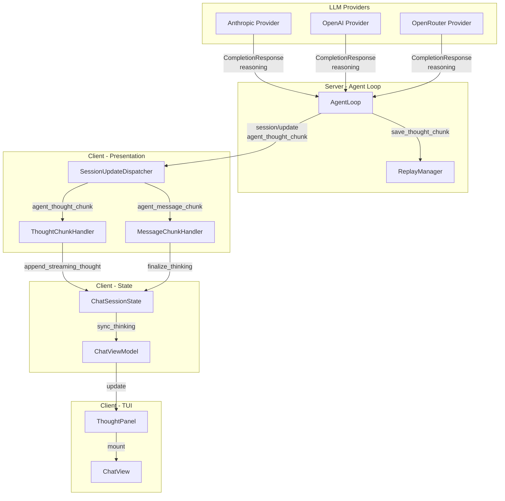

## Context

ACP спецификация определяет `agent_thought_chunk` как тип `SessionUpdate` для streaming internal reasoning агента. Текущая реализация имеет:

**Клиент (частично):**
- Pydantic модель `ThoughtChunkUpdate` в `client/messages.py:453-465`
- Парсинг в `parse_structured_session_update()` в `client/messages.py:980-981`
- Тест парсинга в `tests/client/test_messages.py:481-498`

**Сервер (отсутствует):**
- Нет извлечения reasoning из LLM ответов
- Нет генерации `agent_thought_chunk` notifications
- Нет сохранения thought chunks в events_history

**LLM провайдеры (отсутствует):**
- `CompletionResponse` не имеет поля для reasoning
- Провайдеры не извлекают thinking/reasoning контент

**Клиент (отсутствует):**
- Нет handler для `agent_thought_chunk`
- Нет state для thinking текста
- Нет UI виджета для отображения reasoning

## Goals / Non-Goals

**Goals:**
- Извлекать reasoning контент из ответов LLM провайдеров (Anthropic, OpenAI, OpenRouter)
- Генерировать `agent_thought_chunk` notifications согласно ACP спецификации
- Сохранять thought chunks в events_history для replay при `session/load`
- Обрабатывать `agent_thought_chunk` на клиенте через handler pattern
- Отображать reasoning в TUI отдельным collapsible виджетом
- Обеспечить обратную совместимость (reasoning опционален)

**Non-Goals:**
- Реализация `thought_level` config option (отдельная задача)
- Streaming reasoning от провайдеров в реальном времени (только post-completion extraction)
- Кэширование reasoning между сессиями
- Агрегация reasoning token metrics

## Decisions

### Decision 1: Reasoning как отдельное поле в CompletionResponse

**Выбор:** Добавить `reasoning: str | None = None` в `CompletionResponse`.

**Альтернативы:**
- A) Использовать `extra: dict` для хранения reasoning → Плохо: нет типобезопасности, требует casting
- B) Создать отдельный `ReasoningResponse` класс → Плохо: дублирование, усложняет интерфейс
- C) **Выбрано:** Опциональное поле `reasoning` в существующем классе → Хорошо: минимальные изменения, типобезопасно

**Обоснование:** Reasoning — естественное расширение ответа LLM. Опциональное поле сохраняет backward compatibility. Все провайдеры возвращают reasoning в разных форматах, но семантически это одна сущность.

### Decision 2: Extraction на уровне провайдера, не AgentLoop

**Выбор:** Каждый LLM провайдер отвечает за извлечение reasoning из своего формата ответа.

**Альтернативы:**
- A) Централизованный parser в AgentLoop → Плохо: провайдеры имеют разные форматы
- B) **Выбрано:** Provider-specific extraction → Хорошо: инкапсуляция, каждый провайдер знает свой формат

**Обоснование:** Anthropic возвращает thinking в `content[].type == "thinking"`, OpenAI — в `delta.reasoning_content`, OpenRouter — в `choices[].message.reasoning`. Централизация потребует знания всех форматов в одном месте.

### Decision 3: Thought notification перед message notification

**Выбор:** Эмитить `agent_thought_chunk` **перед** `agent_message_chunk` в AgentLoop.

**Альтернативы:**
- A) Эмитить после message → Плохо: нарушает хронологию (thinking происходит до ответа)
- B) Интерливить thinking и message → Плохо: усложняет клиентскую логику
- C) **Выбрано:** Thinking → Message (sequential) → Хорошо: соответствует ментальной модели

**Обоснование:** LLM сначала "думает", потом "отвечает". Порядок notifications должен отражать этот процесс. Клиент может свернуть thinking когда начинается message.

### Decision 4: Thought chunks в events_history для replay

**Выбор:** Сохранять `agent_thought_chunk` в `_REPLAYABLE_UPDATE_TYPES` и events_history.

**Альтернативы:**
- A) Не сохранять thinking (только live streaming) → Плохо: теряется контекст при session/load
- B) Сохранять в отдельном хранилище → Плохо: дублирование, усложняет миграцию
- C) **Выбрано:** Единый events_history с thought chunks → Хорошо: консистентность, простой replay

**Обоснование:** ACP спецификация требует replay "entire conversation". Thinking — часть conversation. Клиент может решить показывать или скрывать thinking при replay.

### Decision 5: ThoughtChunkHandler по аналогии с MessageChunkHandler

**Выбор:** Создать отдельный `ThoughtChunkHandler` реализующий `SessionUpdateHandler` protocol.

**Альтернативы:**
- A) Расширить `MessageChunkHandler` для обработки thought → Плохо: смешение ответственности
- B) **Выбрано:** Отдельный handler → Хорошо: SRP, тестируемость, консистентность с другими handlers

**Обоснование:** `MessageChunkHandler` обрабатывает `agent_message_chunk` и `user_message_chunk`. Thought — семантически другой тип (reasoning, не ответ). Отдельный handler упрощает тестирование и расширение.

### Decision 6: Thinking state отделён от messages

**Выбор:** Добавить `thinking_text: str` и `is_thinking_streaming: bool` в `ChatSessionState`, не в `messages`.

**Альтернативы:**
- A) Добавлять thinking как сообщение с role="thinking" → Плохо: thinking не часть истории
- B) **Выбрано:** Отдельные поля в state → Хорошо: thinking не попадает в messages, легко управлять

**Обоснование:** Thinking — временный поток, который сворачивается когда начинается ответ. Не должен персиститься в messages. Отдельные поля упрощают управление lifecycle.

### Decision 7: TUI ThoughtPanel как CollapsiblePanel

**Выбор:** Создать `ThoughtPanel` наследующий `CollapsiblePanel`, сворачиваемый по умолчанию.

**Альтернативы:**
- A) Использовать существующий `ThinkingIndicator` → Плохо: это анимация, не контент
- B) Inline thinking в message bubble → Плохо: clutter, нет контроля
- C) **Выбрано:** Отдельный collapsible panel → Хорошо: контроль видимости, чистый UI

**Обоснование:** `ThinkingIndicator` — анимация "агент думает". `ThoughtPanel` — контейнер для reasoning текста. Разные семантики. Collapsible позволяет пользователю контролировать видимость.

## Architecture



## Data Flow

```mermaid
sequenceDiagram
    participant LLM as LLM Provider
    participant Loop as AgentLoop
    participant Replay as ReplayManager
    participant Transport as Transport
    participant Dispatcher as SessionUpdateDispatcher
    participant Handler as ThoughtChunkHandler
    participant State as ChatSessionState
    participant VM as ChatViewModel
    participant UI as ThoughtPanel

    LLM->>Loop: CompletionResponse(text="Answer", reasoning="Thinking...")
    
    Loop->>Loop: Check response.reasoning is not None
    
    alt Has reasoning
        Loop->>Replay: save_thought_chunk(session, {type: "text", text: reasoning})
        Replay->>Replay: Append to events_history
        
        Loop->>Transport: session/update {sessionUpdate: "agent_thought_chunk", content: {...}}
        Transport->>Dispatcher: Dispatch update
        
        Dispatcher->>Dispatcher: Find handler for "agent_thought_chunk"
        Dispatcher->>Handler: handle(update_data, context)
        
        Handler->>State: append_streaming_thought(reasoning_text)
        State->>State: thinking_text += reasoning_text
        
        Handler->>VM: sync_thinking(session_id, thinking_text, is_streaming=True)
        VM->>UI: Update thought panel content
    end
    
    Loop->>Transport: session/update {sessionUpdate: "agent_message_chunk", content: {...}}
    Transport->>Dispatcher: Dispatch update
    Dispatcher->>Handler: handle (MessageChunkHandler)
    
    Handler->>State: finalize_thinking()
    State->>State: thinking_text = "", is_thinking_streaming = False
    
    Handler->>VM: sync_thinking(session_id, "", is_streaming=False)
    VM->>UI: Collapse thought panel
    
    Handler->>State: append_streaming_text(answer_text)
    Handler->>VM: sync_streaming(session_id, text, is_streaming=True)
```

## Component Design

### 1. CompletionResponse Extension

```python
@dataclass
class CompletionResponse:
    text: str
    tool_calls: list[LLMToolCall] = field(default_factory=list)
    stop_reason: StopReason = StopReason.END_TURN
    model: str | None = None
    usage: dict[str, Any] = field(default_factory=dict)
    extra: dict[str, Any] = field(default_factory=dict)
    reasoning: str | None = None  # NEW: Internal reasoning from LLM
```

### 2. ReplayManager Extension

```python
class ReplayManager:
    _REPLAYABLE_UPDATE_TYPES: frozenset[str] = frozenset({
        "user_message_chunk",
        "agent_message_chunk",
        "agent_thought_chunk",  # NEW
        "tool_call",
        "tool_call_update",
        "plan",
        "session_info",
    })

    def save_thought_chunk(
        self,
        session: SessionState,
        content: dict[str, Any],
    ) -> None:
        """Сохраняет agent_thought_chunk в events_history."""
        self._save_update(
            session,
            {
                "sessionUpdate": "agent_thought_chunk",
                "content": content,
            },
        )
```

### 3. AgentLoop Extension

```python
class AgentLoop:
    async def run(self, ...):
        # ... LLM call ...
        response = await self._strategy.call(...)
        
        # NEW: Emit thought chunk if reasoning present
        if response.reasoning:
            thought_content = {"type": "text", "text": response.reasoning}
            self._replay_manager.save_thought_chunk(session, thought_content)
            notification = self._build_thought_notification(session_id, response.reasoning)
            if not await self._send_notification_immediately(notification):
                notifications.append(notification)
        
        # Existing: Emit message chunk
        if response.text:
            # ... existing logic ...
    
    def _build_thought_notification(self, session_id: str, reasoning: str) -> ACPMessage:
        """Построить notification с reasoning агента."""
        return ACPMessage.notification(
            "session/update",
            {
                "sessionId": session_id,
                "update": {
                    "sessionUpdate": "agent_thought_chunk",
                    "content": {"type": "text", "text": reasoning},
                },
            },
        )
```

### 4. ThoughtChunkHandler

```python
class ThoughtChunkHandler:
    """Обработчик обновлений reasoning агента."""

    def can_handle(self, update_type: str) -> bool:
        return update_type == "agent_thought_chunk"

    def handle(self, update_data: dict[str, Any], context: ChatUpdateContext) -> None:
        update = update_data.get("params", {}).get("update", {})
        content = update.get("content", {})
        text = content.get("text", "")

        if not text:
            return

        context.state.append_streaming_thought(text)
        if context.sink is not None:
            context.sink.sync_thinking(
                context.session_id,
                context.state.thinking_text,
                context.state.is_thinking_streaming,
            )
```

### 5. ChatSessionState Extension

```python
@dataclass
class ChatSessionState:
    messages: list[dict[str, str]] = field(default_factory=list)
    tool_calls: list[dict[str, Any]] = field(default_factory=list)
    pending_permissions: list[Any] = field(default_factory=list)
    streaming_text: str = ""
    is_streaming: bool = False
    last_stop_reason: str | None = None
    replay_updates: list[dict[str, Any]] = field(default_factory=list)
    
    # NEW: Thinking state
    thinking_text: str = ""
    is_thinking_streaming: bool = False

    def append_streaming_thought(self, text: str) -> None:
        """Добавляет текст к reasoning потоку."""
        self.thinking_text += text
        self.is_thinking_streaming = True

    def finalize_thinking(self) -> None:
        """Завершает thinking поток."""
        self.thinking_text = ""
        self.is_thinking_streaming = False
```

### 6. ChatUpdateSink Extension

```python
@runtime_checkable
class ChatUpdateSink(Protocol):
    def sync_messages(self, session_id: str, messages: list[dict[str, str]]) -> None: ...
    def sync_tool_calls(self, session_id: str, tool_calls: list[dict[str, Any]]) -> None: ...
    def sync_streaming(self, session_id: str, text: str, is_streaming: bool) -> None: ...
    
    # NEW
    def sync_thinking(self, session_id: str, text: str, is_streaming: bool) -> None:
        """Синхронизирует reasoning текст с UI."""
        ...
```

### 7. ThoughtPanel TUI Widget

```python
class ThoughtPanel(CollapsiblePanel):
    """Collapsible panel для отображения reasoning агента."""

    DEFAULT_TITLE = "Reasoning"
    
    def __init__(self, **kwargs):
        super().__init__(**kwargs)
        self._content = Markdown("")
        self._is_collapsed = True  # По умолчанию свёрнут

    def update_content(self, text: str) -> None:
        """Обновляет содержимое reasoning."""
        self._content.update(text)
        if text and self._is_collapsed:
            self._is_collapsed = False
            self.expand()

    def collapse_after_answer(self) -> None:
        """Сворачивает panel после начала ответа."""
        self._is_collapsed = True
        self.collapse()
```

## Risks / Trade-offs

### Risk 1: Увеличение размера events_history
**Проблема:** Thought chunks добавляют объём в events_history.
**Mitigation:** Мониторить размер сессий. В будущем — опциональное отключение сохранения thinking.

### Risk 2: Provider-specific форматы reasoning
**Проблема:** Anthropic, OpenAI, OpenRouter имеют разные форматы.
**Mitigation:** Единый интерфейс `CompletionResponse.reasoning`. Каждый провайдер адаптирует свой формат. Тесты для каждого провайдера.

### Risk 3: UI clutter при длинном reasoning
**Проблема:** Reasoning может быть очень длинным.
**Mitigation:** ThoughtPanel свёрнут по умолчанию. Пользователь контролирует видимость. В будущем — truncation или summary.

### Risk 4: Thinking без последующего ответа
**Проблема:** LLM может вернуть reasoning, но не ответить (error, cancel).
**Mitigation:** Thinking сохраняется в state до явной финализации. При cancel — finalize_thinking() вызывается в cleanup.

### Risk 5: Replay order consistency
**Проблема:** Thought chunks должны replay в правильном порядке.
**Mitigation:** events_history — упорядоченный список. Thought chunks сохраняются в момент emission, до message chunks.

## Migration Plan

### Phase 1: Server Foundation (без LLM integration)
1. Добавить `reasoning: str | None` в `CompletionResponse`
2. Реализовать `save_thought_chunk()` в `ReplayManager`
3. Добавить `_build_thought_notification()` в `AgentLoop`
4. Эмитить thought notifications при наличии reasoning
5. Тесты с mock reasoning

**Rollback:** Удалить reasoning поле и emission логику. Backward compatible.

### Phase 2: LLM Provider Integration
1. Anthropic: извлекать thinking blocks
2. OpenAI: извлекать reasoning_content
3. OpenRouter: извлекать reasoning
4. Тесты для каждого провайдера

**Rollback:** Провайдеры возвращают `reasoning=None`. Существующая логика не меняется.

### Phase 3: Client Handling
1. Добавить thinking state в `ChatSessionState`
2. Создать `ThoughtChunkHandler`
3. Зарегистрировать в dispatcher
4. Добавить `sync_thinking()` в sink
5. Тесты

**Rollback:** Клиент игнорирует `agent_thought_chunk` (per spec).

### Phase 4: TUI Display
1. Создать `ThoughtPanel`
2. Интеграция с `ChatView`
3. Тесты

**Rollback:** Удалить виджет. Thinking не отображается, но обрабатывается.

## Open Questions

### Q1: Streaming reasoning от провайдеров?
**Вопрос:** Поддерживать ли streaming reasoning в реальном времени (chunk-by-chunk)?
**Статус:** Не в scope. Текущий дизайн — post-completion extraction.

### Q2: Thought level configuration?
**Вопрос:** Интегрировать ли с `thought_level` config option (ACP 13-Session Config Options)?
**Статус:** Не в scope. Отдельная задача.

### Q3: Thinking token metrics?
**Вопрос:** Отображать ли количество reasoning tokens?
**Статус:** Не в scope. Требует изменения `usage` в CompletionResponse.

### Q4: Persistence thinking в file chat history?
**Вопрос:** Сохранять ли thinking в file-based chat persistence?
**Статус:** Не в scope. Thinking — ephemeral, не часть messages.
