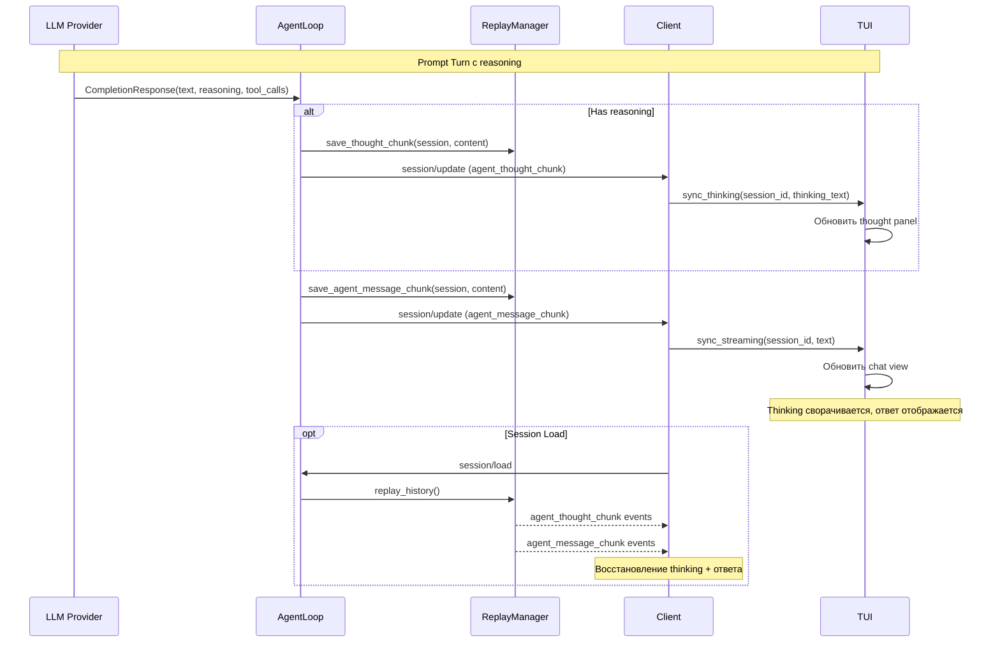

## Why

ACP спецификация определяет тип `agent_thought_chunk` для streaming internal reasoning агента (05-Prompt Turn, 17-Schema). Это позволяет клиентам отображать процесс мышления агента отдельно от финального ответа, улучшая прозрачность и UX.

Современные LLM (Claude с extended thinking, OpenAI o1/o3 с reasoning) возвращают reasoning контент, но текущая реализация:
- Не извлекает reasoning из ответов LLM-провайдеров
- Не генерирует `agent_thought_chunk` notifications на сервере
- Не обрабатывает и не отображает `agent_thought_chunk` на клиенте

Клиент имеет только parsing модель (`ThoughtChunkUpdate` в `client/messages.py:453-465`), но нет handler, state, или UI для отображения.

## What Changes

### Уровень 1: LLM-провайдеры (источник reasoning)
- Добавить поле `reasoning: str | None` в `CompletionResponse` (`server/llm/models.py`)
- **Anthropic provider**: извлекать `thinking` content blocks из streaming/non-streaming ответов
- **OpenAI provider**: извлекать `reasoning_content` из delta (o1/o3 модели)
- **OpenRouter provider**: извлекать `reasoning` field

### Уровень 2: Сервер (генерация `agent_thought_chunk`)
- Добавить `save_thought_chunk()` метод в `ReplayManager`
- Добавить `"agent_thought_chunk"` в `_REPLAYABLE_UPDATE_TYPES` для replay при `session/load`
- Добавить `_build_thought_notification()` helper в `AgentLoop`
- В `AgentLoop.run()` — при наличии `response.reasoning`, эмитить `agent_thought_chunk` **перед** `agent_message_chunk`
- Сохранять thought chunks в `events_history` для replay
- Аналогично в `StrategyDispatcher` (где эмитятся `agent_message_chunk`)

### Уровень 3: Клиент (обработка и отображение)
- Добавить `thinking_text: str` и `is_thinking_streaming: bool` в `ChatSessionState`
- Добавить `append_streaming_thought()` и `finalize_thinking()` методы
- Создать `ThoughtChunkHandler` (по аналогии с `MessageChunkHandler`)
- Зарегистрировать handler в `SessionUpdateDispatcher`
- Добавить `sync_thinking()` в `ChatUpdateSink` protocol
- Реализовать `sync_thinking()` в `ChatViewModel`
- Создать TUI-виджет для отображения reasoning (collapsible panel)
- Обработать replay thought chunks при `session/load`

### Уровень 4: Интеграция и edge cases
- Thought chunks НЕ попадают в `messages` историю (это reasoning, не ответ)
- Thinking отображается до/во время `agent_message_chunk`, но не после `end_turn`
- При `session/cancel` — остановить streaming thinking
- Поддержка `_meta` в thought chunks (per spec)
- Replay thought chunks при `session/load`

## Capabilities

### New Capabilities
- `llm-reasoning-extraction`: Извлечение reasoning/thinking контента из ответов LLM-провайдеров (Anthropic, OpenAI, OpenRouter)
- `server-thought-streaming`: Генерация `agent_thought_chunk` notifications на сервере и сохранение в events_history для replay
- `client-thought-handling`: Обработка `agent_thought_chunk` на клиенте — handler, state, sink, ViewModel интеграция
- `tui-thought-display`: TUI-виджет для отображения reasoning агента (collapsible panel, отдельный от `ThinkingIndicator`)

### Modified Capabilities
- `multi-provider-llm`: Добавление поля `reasoning` в `CompletionResponse`, поддержка reasoning для Anthropic/OpenAI/OpenRouter
- `client-session-update-dispatcher`: Добавление `ThoughtChunkHandler` и регистрация в dispatcher
- `session-state`: Добавление `thinking_text` и `is_thinking_streaming` в `ChatSessionState`

## Impact

**Новые файлы:**
- `src/codelab/server/protocol/handlers/thought_chunk.py` — helper для генерации thought notifications
- `src/codelab/client/presentation/chat/handlers/thought_chunk_handler.py` — ThoughtChunkHandler
- `src/codelab/client/tui/components/thought_panel.py` — TUI виджет для reasoning

**Изменяемые файлы (сервер):**
- `src/codelab/server/llm/models.py` — добавить `reasoning` в `CompletionResponse`
- `src/codelab/server/llm/providers/anthropic.py` — извлекать thinking blocks
- `src/codelab/server/llm/providers/openai.py` — извлекать reasoning_content
- `src/codelab/server/llm/providers/openrouter.py` — извлекать reasoning
- `src/codelab/server/protocol/handlers/replay_manager.py` — save_thought_chunk(), replay support
- `src/codelab/server/protocol/handlers/pipeline/stages/agent_loop.py` — эмитить thought notifications
- `src/codelab/server/agent/strategies/dispatcher.py` — эмитить thought notifications

**Изменяемые файлы (клиент):**
- `src/codelab/client/presentation/chat/chat_session_state.py` — thinking_text, is_thinking_streaming
- `src/codelab/client/presentation/chat/dispatcher/session_update_dispatcher.py` — регистрация ThoughtChunkHandler
- `src/codelab/client/presentation/chat/contracts.py` — sync_thinking() в ChatUpdateSink
- `src/codelab/client/presentation/chat_view_model.py` — реализация sync_thinking()
- `src/codelab/client/presentation/chat/handlers/message_chunk_handler.py` — финализация thinking при agent_message_chunk

**Зависимости:** Зависит от ACP спецификации (17-Schema.md — SessionUpdate union type).

## Sequence Diagram

## Implementation Phases

### Phase 1: Server Foundation (Серверная основа)
1. Добавить `reasoning` поле в `CompletionResponse`
2. Реализовать `save_thought_chunk()` в `ReplayManager`
3. Добавить `_build_thought_notification()` в `AgentLoop`
4. Эмитить `agent_thought_chunk` при наличии reasoning
5. Тесты для ReplayManager и AgentLoop

**Результат:** Сервер генерирует `agent_thought_chunk` notifications (с mock reasoning)

### Phase 2: LLM Provider Integration
1. Anthropic: извлекать thinking content blocks
2. OpenAI: извлекать reasoning_content
3. OpenRouter: извлекать reasoning field
4. Тесты для каждого провайдера

**Результат:** Реальный reasoning от LLM провайдеров

### Phase 3: Client Handling
1. Добавить thinking state в `ChatSessionState`
2. Создать `ThoughtChunkHandler`
3. Зарегистрировать в `SessionUpdateDispatcher`
4. Добавить `sync_thinking()` в sink/viewmodel
5. Тесты для handler и state

**Результат:** Клиент обрабатывает `agent_thought_chunk`

### Phase 4: TUI Display
1. Создать `ThoughtPanel` виджет
2. Интеграция с `ChatView`
3. Collapsible UI для reasoning
4. Тесты для виджета

**Результат:** Пользователь видит reasoning агента в UI

## Design Principles

### Separation of Concerns
- Reasoning (thinking) и ответ (message) — разные потоки данных
- Thinking НЕ попадает в историю сообщений
- Thinking сворачивается/скрывается когда начинается ответ

### Replay Consistency
- Thought chunks сохраняются в `events_history` в порядке появления
- При `session/load` replay восстанавливает полную картину: thinking → answer
- `_REPLAYABLE_UPDATE_TYPES` включает `"agent_thought_chunk"`

### Backward Compatibility
- `reasoning` поле опционально в `CompletionResponse` (default: None)
- Клиенты без `ThoughtChunkHandler` игнорируют `agent_thought_chunk` (per spec)
- Существующие провайдеры без reasoning продолжают работать

## Testing Strategy

### Unit Tests
- **LLM providers**: Mock responses с reasoning, проверка извлечения
- **ReplayManager**: save_thought_chunk, replay с thought chunks
- **AgentLoop**: emission thought notifications при наличии reasoning
- **ThoughtChunkHandler**: обработка agent_thought_chunk updates
- **ChatSessionState**: thinking_text accumulation, finalize_thinking

### Integration Tests
- End-to-end: LLM → Server → Client → State
- Session load с thought replay
- Cancel во время thinking streaming

### Edge Cases
- Пустой reasoning (None или "")
- Thinking без последующего ответа
- Multiple thinking chunks в одном turn
- Thinking при tool calls

## Risks and Mitigations

### Risk 1: Token cost
**Mitigation:** Reasoning tokens уже включены в стоимость LLM API. Не увеличиваем потребление.

### Risk 2: UI clutter
**Mitigation:** Thought panel collapsible по умолчанию. Пользователь контролирует видимость.

### Risk 3: Provider inconsistency
**Mitigation:** Единый интерфейс `CompletionResponse.reasoning`. Каждый провайдер адаптирует свой формат.

### Risk 4: Replay size
**Mitigation:** Thought chunks увеличивают events_history. Мониторить размер сессий.

## Future Enhancements

### Thought Level Configuration
- ConfigOption для выбора reasoning level (per ACP 13-Session Config Options)
- Category: `thought_level`

### Thinking Token Metrics
- Отображение количества reasoning tokens
- Сравнение thinking time vs response time

### Streaming Optimization
- Batch thought chunks для уменьшения network overhead
- Throttling UI updates при высоком frequency
