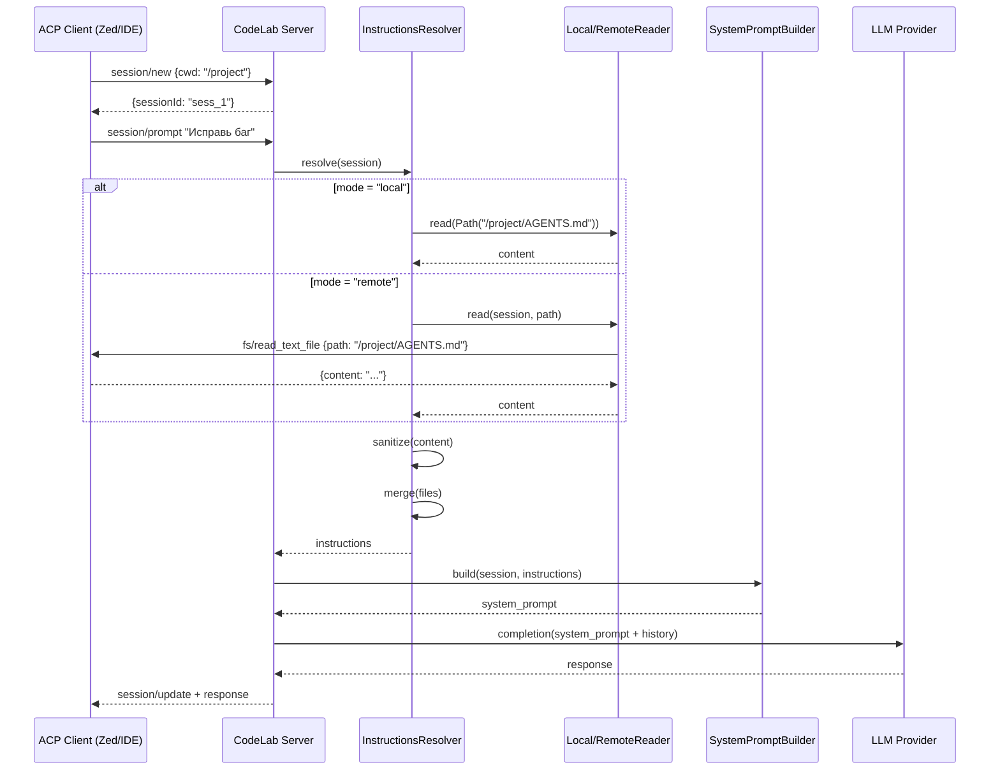

# Proposal: Поддержка AGENTS.md инструкций

## Почему

Агент не учитывает контекст проекта при работе. Файлы `AGENTS.md` (и совместимые: `CLAUDE.md`, `.cursorrules`) — это стандартный механизм передачи инструкций от проекта к AI-агенту. Zed IDE, Cursor, Claude Code и другие инструменты уже поддерживают этот формат.

**Проблема**: CodeLab-агент не читает `AGENTS.md`, поэтому:
- Не знает о командах тестирования (`make check`)
- Не соблюдает архитектурные ограничения проекта
- Не следует coding conventions

**Решение**: Реализовать загрузку и инъекцию инструкций в system prompt с поддержкой двух режимов работы (local/remote), соответствующих архитектуре ACP.

---

## Что изменяется

### Новые возможности

1. **Загрузка инструкций из файлов проекта** — `AGENTS.md`, `CLAUDE.md`, `.cursorrules` (приоритетный список)
2. **Два режима чтения**:
   - `local` — прямое чтение с файловой системы сервера (сервер и клиент на одной машине)
   - `remote` — чтение через ACP `fs/read_text_file` (сервер удалён от клиента)
3. **Кэширование с отслеживанием изменений** — mtime для local, polling для remote
4. **Защита от prompt injection** — санитизация содержимого файлов
5. **Конфигурация через `codelab.toml`** — режим, список файлов, лимиты

### Модификации

- `SystemPromptBuilder` — интеграция инструкций между agent prompt и global prompt
- `AppConfig` — новая секция `[agents.instructions]`
- DI-контейнер — регистрация новых компонентов

---

## Capabilities

### Новые capabilities

- **`agents-instructions`**: Загрузка, объединение и инъекция инструкций из `AGENTS.md` в system prompt. Включает:
  - Discovery файлов в рабочей директории (`cwd` из `session/new`)
  - Чтение через `Path.read_text()` (local) или `ClientRPCBridge.read_file()` (remote)
  - Санитизацию от prompt injection
  - Кэширование с проверкой актуальности

### Модифицированные capabilities

- **`agent-config`**: Добавление секции `[agents.instructions]` в конфигурацию
- **`single-strategy`**: Интеграция инструкций в формирование system prompt через `SystemPromptBuilder`

---

## Влияние

### Затронутый код

| Слой | Компоненты | Изменения |
|------|------------|-----------|
| `server/agent/` | `system_prompt_builder.py` | Добавление `instructions_resolver` |
| `server/agent/instructions/` | **НОВЫЙ МОДУЛЬ** | `config.py`, `local_reader.py`, `remote_reader.py`, `discovery.py`, `merger.py`, `sanitizer.py`, `resolver.py` |
| `server/config.py` | `AppConfig`, `AgentsConfig` | Новая секция `instructions` |
| `server/di.py` | `PipelineProvider` | Регистрация новых компонентов |

### ACP-протокол

| Метод | Использование |
|-------|---------------|
| `session/new` | Получение `cwd` — точки начала discovery |
| `fs/read_text_file` | Чтение файлов инструкций в remote-режиме |
| `initialize` | Проверка `clientCapabilities.fs.readTextFile` для выбора режима |

### Зависимости

- Новые зависимости: **нет** (используется стандартная библиотека `pathlib`, `re`)
- Существующие: `ClientRPCBridge` (для remote), `SessionState` (для `cwd`)

---

## Архитектура (Flow)

---

## Ограничения

| Аспект | Local режим | Remote режим |
|--------|-------------|--------------|
| Иерархия (подкаталоги) | Да (Phase 3) | Нет (нет `fs/list_directory` в ACP) |
| File watch | mtime (Phase 4) | Polling каждый prompt turn |
| Производительность | Быстро | +1 RTT на prompt |
| Совместимость | Всегда | Требует `fs.readTextFile` capability |

---

## Этапы реализации

| Фаза | Описание | Статус |
|------|----------|--------|
| **Phase 1 (MVP)** | Root-level, local mode, санитизация | **Текущая** |
| Phase 2 | Remote mode (`fs/read_text_file`) | — |
| Phase 3 | Hierarchy (обход дерева для local) | — |
| Phase 4 | Watch mechanism (mtime/polling) | — |

---

## Критерии приёмки

1. Агент читает `AGENTS.md` из `cwd` при `mode = "local"`
2. Инструкции инжектируются в system prompt между agent prompt и global prompt
3. Конфигурация через `codelab.toml` работает
4. Prompt injection паттерны санитизируются
5. Все компоненты покрыты тестами
6. `make check` проходит без ошибок
