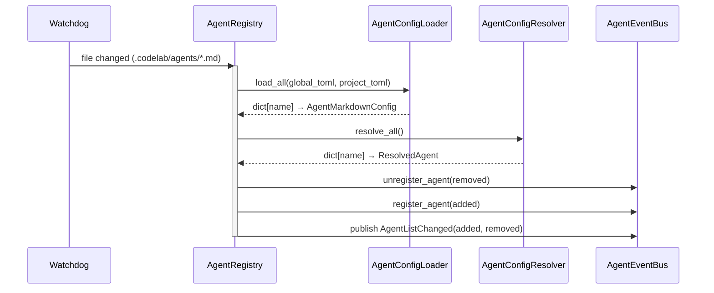

## Why

Мультиагентная система требует динамической загрузки, регистрации и hot reload агентов без перезапуска сервера. Конфигурация агентов должна поддерживаться из TOML (глобальные настройки) и Markdown файлов (системные промпты) с приоритетом override, аналогично OpenCode.

## What Changes

- `AgentConfigLoader` — загрузка из 4 источников с override логикой:
  1. `.codelab/agents/*.md` — проектные Markdown (высший приоритет)
  2. `codelab.toml` → `[agents.definitions.*]` — проектные TOML
  3. `~/.codelab/agents/*.md` — глобальные Markdown
  4. `~/.codelab/codelab.toml` → `[agents.definitions.*]` — глобальные TOML
- `AgentConfigResolver` — merge global settings + agent configs → `ResolvedAgent`
- `AgentRegistry` — единый реестр, register/unregister в EventBus, hot reload через watchdog
- Pydantic модели: `AgentTOMLConfig`, `AgentsGlobalConfig`, `AgentMarkdownConfig`, `ResolvedAgent`
- Расширение `AppConfig` секцией `agents_global`
- Обновление `codelab.toml.example` с примерами конфигурации агентов
- Параметры агентов: mode, priority, model, temperature, tools, permissions, prompt

## Capabilities

### New Capabilities
- `agent-config-toml`: Глобальные настройки мультиагентности в TOML [agents]
- `agent-config-markdown`: Определение агентов в Markdown файлах с YAML frontmatter
- `agent-registry`: Единый реестр агентов с hot reload через watchdog
- `agent-config-resolver`: Разрешение конфигурации с defaults из глобальных настроек
- `agent-config-loader`: Загрузка из 4 источников с override логикой

### Modified Capabilities
- `codelab`: Расширение AppConfig секцией agents_global, обновление codelab.toml.example

## Impact

**Новые файлы:**
- `codelab/src/codelab/server/agent/config/` — AgentConfigLoader, AgentConfigResolver, модели
- `codelab/src/codelab/server/agent/registry.py` — AgentRegistry
- `codelab/tests/server/agent/test_config_loader.py`
- `codelab/tests/server/agent/test_config_resolver.py`
- `codelab/tests/server/agent/test_registry.py`

**Изменяемые файлы:**
- `codelab/src/codelab/server/config.py` — расширение AppConfig
- `codelab/codelab.toml.example` — примеры агентов

**Зависимости:** Зависит от `multiagent-event-bus` (AgentEventBus для publish lifecycle events).

