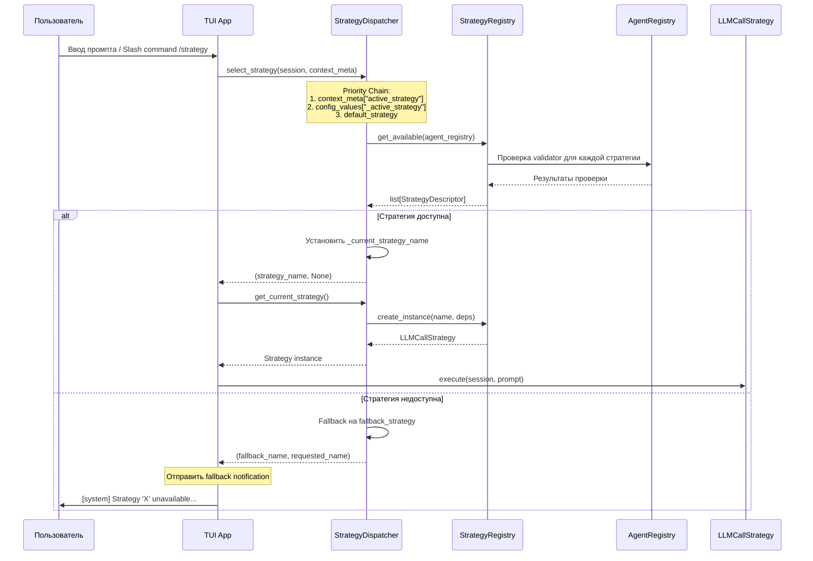
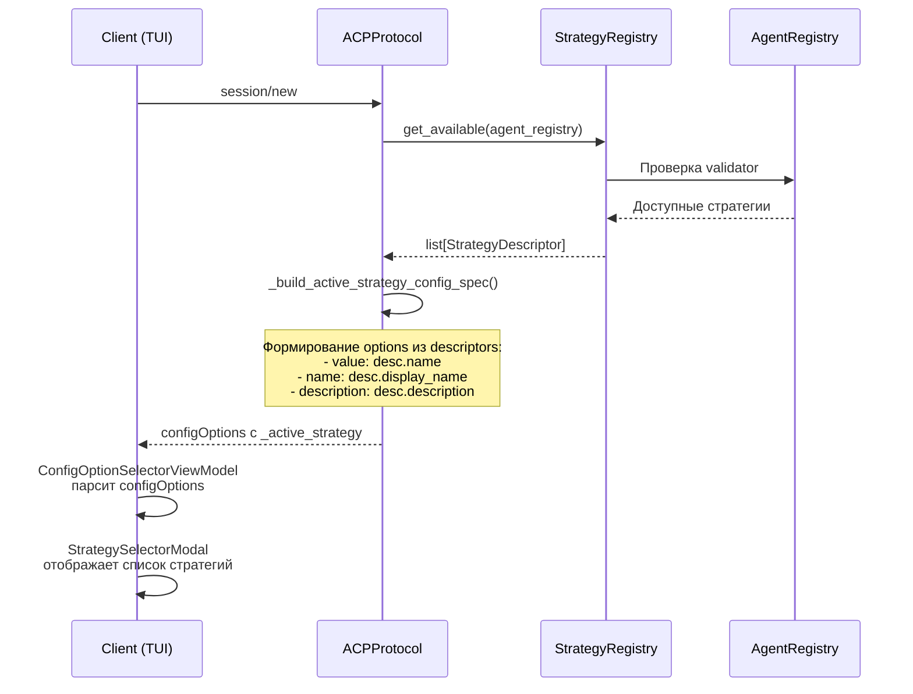
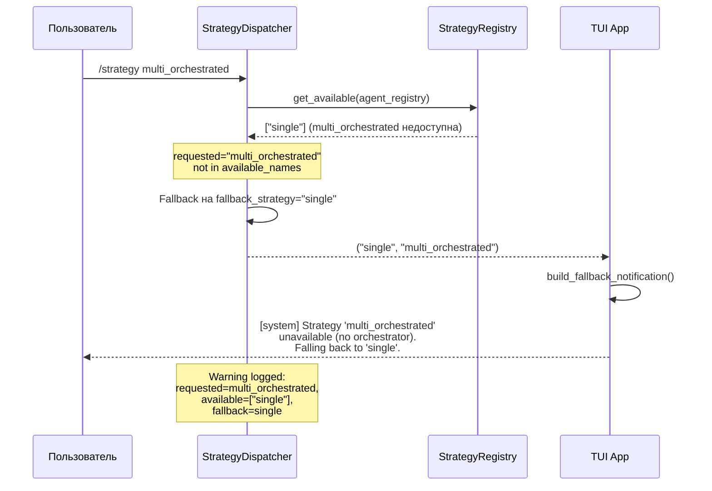

## Design

### Архитектура StrategyDispatcher с StrategyRegistry

StrategyDispatcher выбирает стратегию выполнения по приоритету и валидирует доступность через StrategyRegistry (Registry Pattern).

### Registry Pattern

Следуем архитектурному паттерну проекта:
- `AgentRegistry` — реестр агентов
- `LLMProviderRegistry` — реестр LLM провайдеров
- `ToolRegistry` — реестр инструментов
- **`StrategyRegistry`** — реестр стратегий (НОВОЕ)

### Компоненты

```
┌─────────────────────────────────────────────────────────────────┐
│              StrategyDescriptor (self-describing)               │
├─────────────────────────────────────────────────────────────────┤
│ name: str              # "single"                               │
│ display_name: str      # "Single"                               │
│ description: str       # "Single agent execution"               │
│ factory: Callable      # создает экземпляр стратегии            │
│ validator: Callable    # проверяет доступность через Registry   │
└─────────────────────────────────────────────────────────────────┘
                              │
                              ▼
┌─────────────────────────────────────────────────────────────────┐
│                       StrategyRegistry                          │
├─────────────────────────────────────────────────────────────────┤
│ register(descriptor)                                            │
│ get(name) → StrategyDescriptor | None                           │
│ get_available(agent_registry) → list[StrategyDescriptor]        │
│ create_instance(name, deps) → LLMCallStrategy                   │
│ list_all() → list[StrategyDescriptor]                           │
└─────────────────────────────────────────────────────────────────┘
         │                              │
         ▼                              ▼
┌─────────────────────┐    ┌─────────────────────────────────────┐
│ StrategyDispatcher  │    │    ACPProtocol                       │
├─────────────────────┤    ├─────────────────────────────────────┤
│ ТОЛЬКО маршрутизация│    │ _build_active_strategy_config_spec() │
│                     │    │   → registry.get_available()         │
│ select_strategy()   │    │   → descriptor.display_name          │
│ priority chain      │    │   → descriptor.description           │
│ fallback            │    │                                      │
└─────────────────────┘    └─────────────────────────────────────┘
```

### Sequence Diagram: Strategy Selection



### Sequence Diagram: Dynamic configOptions



### Sequence Diagram: Fallback Flow



### Priority Chain

```
1. context.meta["active_strategy"]     — slash command override
2. config_values["_active_strategy"]   — persistent config option
3. "single"                            — default fallback
```

### Validation Matrix

| Стратегия | Требуется | При fail → |
|---|---|---|
| Single | Любой агент | — (всегда доступно) |
| Orchestrated | ≥1 orchestrator + ≥1 subagent | fallback_mode |
| Choreography | ≥2 subagents | fallback_mode |
| Hierarchical | ≥1 primary + ≥1 subagent | fallback_mode |

### StrategyDescriptor

Каждая стратегия self-describing — содержит всю информацию о себе:

```python
@dataclass
class StrategyDescriptor:
    name: str                    # "single"
    display_name: str            # "Single"
    description: str             # "Single agent execution"
    factory: Callable            # создает экземпляр стратегии
    validator: Callable          # проверяет доступность через AgentRegistry
```

Пример для SingleStrategy:

```python
SINGLE_STRATEGY_DESCRIPTOR = StrategyDescriptor(
    name="single",
    display_name="Single",
    description="Single agent execution via EventBus",
    factory=lambda deps: SingleStrategy(
        event_bus=deps.event_bus,
        execution_engine=deps.execution_engine,
        tracer=deps.tracer,
        agent_name=deps.agent_name,
    ),
    validator=lambda registry: True,  # всегда доступна
)
```

### StrategyDependencies

Контейнер зависимостей для DI:

```python
@dataclass
class StrategyDependencies:
    event_bus: AgentEventBus
    execution_engine: ExecutionEngine
    tracer: Tracer | None = None
    agent_name: str = "primary"
```

### Динамическое формирование configOptions

```python
def _build_active_strategy_config_spec(self) -> dict[str, Any]:
    # Получить доступные стратегии из Registry
    available = self._strategy_registry.get_available(self._agent_registry)
    
    # Формировать options из descriptors
    options = [
        {
            "value": desc.name,
            "name": desc.display_name,
            "description": desc.description,
        }
        for desc in available
    ]
    
    return {
        "id": "_active_strategy",
        "name": "Strategy",
        "category": "strategy",
        "type": "select",
        "default": current,
        "options": options,
    }
```

### Client-side UI

```
┌─────────────────────────────────────────────────────────────────┐
│                    StrategySelectorViewModel                    │
├─────────────────────────────────────────────────────────────────┤
│ available_strategies: Observable[list[StrategyOption]]          │
│ current_strategy: Observable[str | None]                        │
│ update_strategies_from_config(configOptions)                    │
│ select_strategy_cmd → coordinator.set_config_option()           │
└─────────────────────────────────────────────────────────────────┘
                              │
                              ▼
┌─────────────────────────────────────────────────────────────────┐
│                    StrategySelectorModal                        │
├─────────────────────────────────────────────────────────────────┤
│ Отображает список стратегий                                     │
│ Навигация: ↑↓                                                   │
│ Выбор: Enter                                                    │
│ Закрытие: Esc                                                   │
└─────────────────────────────────────────────────────────────────┘
                              │
                              ▼
┌─────────────────────────────────────────────────────────────────┐
│                         TUI App                                 │
├─────────────────────────────────────────────────────────────────┤
│ Hotkey: Ctrl+S → открыть StrategySelectorModal                  │
│ Подписка: config_option_updated → обновить ViewModel            │
└─────────────────────────────────────────────────────────────────┘
```

### Ключевые решения

| Решение | Обоснование |
|---|---|
| Registry Pattern | Consistency с AgentRegistry, LLMProviderRegistry, ToolRegistry |
| Self-describing strategies | SRP — каждая стратегия знает о себе всё |
| Dynamic configOptions | UI показывает только доступные стратегии |
| StrategyDependencies | Единый контейнер для DI, упрощает factory |
| Dispatcher = только маршрутизация | SRP — не хранит стратегии, не создает metadata |
| Client-side UI | Consistency с ModelSelectorViewModel/Modal |
| Hotkey Ctrl+S | Быстрый доступ к выбору стратегии |

### Преимущества

1. **SRP** — каждый компонент делает одну вещь
2. **OCP** — новая стратегия = добавить descriptor, не менять dispatcher
3. **Consistency** — следует паттернам проекта (Registry Pattern)
4. **Тестируемость** — Registry легко мокать
5. **Hot reload friendly** — при добавлении агентов список обновляется
6. **Честный UI** — пользователь видит только рабочие стратегии
