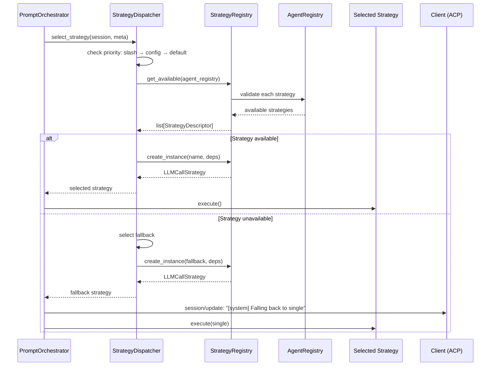
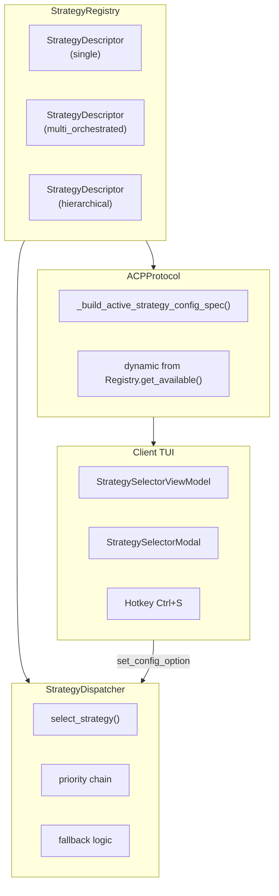

## Why

Мультиагентная система поддерживает 4 стратегии выполнения (single, orchestrated, choreography, hierarchical). Необходим компонент маршрутизации, который выбирает стратегию на основе конфигурации, доступных агентов и slash-команд, с fallback на single при недоступности выбранной стратегии.

## What Changes

### Архитектурные компоненты

- **StrategyRegistry** — единый источник истины о доступных стратегиях (Registry Pattern, аналогично AgentRegistry, LLMProviderRegistry)
- **StrategyDescriptor** — self-describing стратегия с metadata (name, display_name, description, factory, validator)
- **StrategyDispatcher** — ТОЛЬКО маршрутизация (priority chain + fallback), использует StrategyRegistry
- **StrategyDependencies** — контейнер зависимостей для DI

### Priority Chain

- `StrategyDispatcher` — выбор стратегии по приоритету:
  1. Slash command override (`context.meta["active_strategy"]`)
  2. Config value (`config_values["_active_strategy"]`) — persistent режим сессии
  3. Default (`"single"`) — fallback

### Валидация через Registry

- Валидация совместимости mode + стратегия через `AgentRegistry`:
  - Single — всегда доступно
  - Orchestrated — требует orchestrator + subagent
  - Choreography — требует ≥2 subagents
  - Hierarchical — требует primary + subagent

### Динамическое формирование configOptions

- `ACPProtocol._build_active_strategy_config_spec()` формирует список стратегий динамически
- Использует `StrategyRegistry.get_available(agent_registry)`
- Включает ТОЛЬКО доступные стратегии (с валидными агентами)
- Использует `display_name` и `description` из `StrategyDescriptor`

### Client-side UI

- **StrategySelectorViewModel** — парсит configOptions, управляет выбором
- **StrategySelectorModal** — модальное окно выбора стратегии (аналог ModelSelectorModal)
- Hotkey `Ctrl+S` для открытия modal

### Fallback и уведомления

- Fallback на `global.fallback_mode` при недоступности стратегии
- Уведомление пользователю при fallback через `session/update` (agent_message_chunk)
- Config option `_active_strategy` для persistent режима сессии

## Capabilities

### New Capabilities
- `strategy-registry`: Единый реестр стратегий с self-describing descriptors
- `strategy-dispatcher`: Маршрутизация между стратегиями выполнения (priority chain + fallback)
- `strategy-validation`: Валидация совместимости mode + доступных агентов через Registry
- `active-strategy-config`: Конфигурация активной стратегии (slash command + config option + configOptions UI)
- `strategy-fallback`: Fallback на single при недоступности стратегии с уведомлением
- `strategy-selector-ui`: Client-side UI для выбора стратегии (ViewModel + Modal + Hotkey)

### Modified Capabilities
- `codelab`: Добавление config option `_active_strategy`, интеграция в prompt pipeline, динамическое формирование configOptions

## Impact

**Новые файлы:**
- `codelab/src/codelab/server/agent/strategies/descriptor.py` — StrategyDescriptor + StrategyDependencies
- `codelab/src/codelab/server/agent/strategies/registry.py` — StrategyRegistry
- `codelab/src/codelab/client/presentation/strategy_selector_view_model.py` — StrategySelectorViewModel
- `codelab/src/codelab/client/tui/components/strategy_selector.py` — StrategySelectorModal
- `codelab/tests/server/agent/strategies/test_registry.py`
- `codelab/tests/server/agent/strategies/test_dispatcher.py`
- `codelab/tests/client/test_presentation_strategy_selector_view_model.py`
- `codelab/tests/server/test_strategy_integration.py`

**Изменяемые файлы:**
- `codelab/src/codelab/server/agent/strategies/single_strategy.py` — добавить SINGLE_STRATEGY_DESCRIPTOR
- `codelab/src/codelab/server/agent/strategies/dispatcher.py` — использовать StrategyRegistry (только маршрутизация)
- `codelab/src/codelab/server/protocol/core.py` — `_build_active_strategy_config_spec()` из Registry
- `codelab/src/codelab/server/protocol/handlers/config.py` — валидация `_active_strategy`
- `codelab/src/codelab/server/protocol/handlers/pipeline/stages/llm_loop.py` — интеграция select_strategy()
- `codelab/src/codelab/server/protocol/handlers/slash_commands/builtin/strategy.py` — использовать Registry
- `codelab/src/codelab/server/di.py` — StrategyRegistryProvider, StrategyDependencies
- `codelab/src/codelab/client/tui/app.py` — интеграция StrategySelectorViewModel + Modal + hotkey

**Зависимости:** Зависит от всех предыдущих changes (event-bus, llm-adapter, agent-registry, single-strategy, observability).

