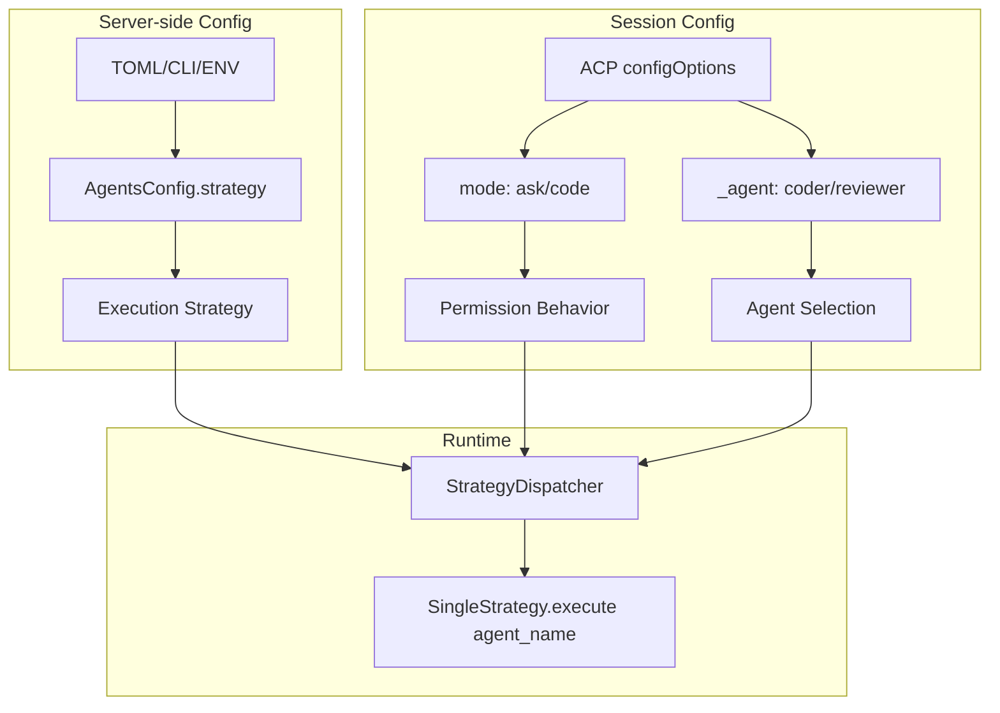

# Design: Dynamic Strategy & Agent Selection

## Проблема

Текущая архитектура использует `mode` для двух разных целей:
1. Execution strategy (single/multi_orchestrated) — из `AgentsConfig.mode`
2. Permission behavior (ask/code) — из `config_values["mode"]`

Это вызывает конфликт при резолвинге в `StrategyDispatcher._resolve_mode()`.

## Решение

Разделить ответственность на три уровня:



## Компоненты

### 1. AgentsConfig (server-side)

```python
class AgentsConfig(BaseModel):
    strategy: str = "single"  # вместо mode
    fallback_strategy: str = "single"  # вместо fallback_mode
    default_model: str = "openai/gpt-4o"
    max_steps: int = 7
```

### 2. ACPProtocol configOptions

```python
def _build_config_specs(self) -> dict[str, dict[str, Any]]:
    # mode — ACP standard (permission behavior)
    mode_spec = {
        "id": "mode",
        "name": "Session Mode",
        "category": "mode",  # ACP standard category
        "type": "select",
        "default": "ask",
        "options": [
            {"value": "ask", "name": "Ask", "description": "Request permission before changes"},
            {"value": "code", "name": "Code", "description": "Execute without confirmation"}
        ]
    }
    
    # _agent — custom category (agent selection)
    agent_spec = self._build_agent_config_spec()
    
    return self._config_option_builder.build_config_specs(
        default_model=default_model,
        additional_specs={"mode": mode_spec, "_agent": agent_spec},
    )

def _build_agent_config_spec(self) -> dict[str, Any]:
    """Построить config spec для _agent из AgentRegistry."""
    primary_agents = self._agent_registry.get_primary_agents()
    sorted_agents = sorted(primary_agents.values(), key=lambda a: a.priority)
    
    options = [
        {
            "value": agent.name,
            "name": agent.name.capitalize(),
            "description": f"{agent.model} (priority: {agent.priority})",
        }
        for agent in sorted_agents
    ]
    
    return {
        "id": "_agent",
        "name": "Agent",
        "category": "_agent",  # custom category
        "type": "select",
        "default": sorted_agents[0].name if sorted_agents else "primary",
        "options": options,
    }
```

### 3. StrategyDispatcher

```python
class StrategyDispatcher:
    def __init__(
        self,
        event_bus: AgentEventBus,
        execution_engine: ExecutionEngine,
        agent_registry: AgentRegistry,  # ← новый параметр
        tracer: Tracer | None = None,
        strategy: str = "single",  # ← из AgentsConfig.strategy
    ) -> None:
        self._agent_registry = agent_registry
        self._strategy_name = strategy
        # ...
    
    async def execute(self, session, prompt, ...) -> AgentResponse:
        # 1. Strategy из server config
        strategy = self._strategies.get(self._strategy_name)
        if strategy is None:
            raise ValueError(f"Unknown strategy: {self._strategy_name}")
        
        # 2. Agent name из session config
        agent_name = session.config_values.get("_agent", "primary")
        
        # 3. Проверяем наличие в Registry
        agent = self._agent_registry.get(agent_name)
        if agent is None:
            raise ValueError(
                f"Agent '{agent_name}' not found in registry. "
                f"Available: {list(self._agent_registry.get_all().keys())}"
            )
        
        # 4. Выполняем
        return await strategy.execute(
            session=session,
            prompt=prompt,
            agent_name=agent_name,  # ← передаём agent_name
            ...
        )
    
    def set_strategy(self, strategy_name: str) -> None:
        """Runtime override (для /strategy slash command)."""
        if strategy_name not in self._strategies:
            raise ValueError(f"Unknown strategy: {strategy_name}")
        self._strategy_name = strategy_name
```

### 4. SingleStrategy

```python
class SingleStrategy:
    async def execute(
        self,
        session: SessionState,
        prompt: str,
        agent_name: str | None = None,  # ← новый параметр
        ...
    ) -> BaseAgentResponse:
        target_agent = agent_name or self.agent_name
        
        request = AgentRequest(
            target_agent=target_agent,  # ← используем target_agent
            ...
        )
        
        response = await self.event_bus.send_request(request=request, ...)
        
        # Tracing
        if span and self.tracer:
            self.tracer.end_span(
                span,
                attributes={"agent_name": target_agent, ...},
            )
        
        return response
```

### 5. Slash command `/strategy`

```python
class StrategyCommandHandler(CommandHandler):
    """Handler для команды /strategy."""
    
    AVAILABLE_STRATEGIES = ["single", "multi_orchestrated", "hierarchical"]
    
    def execute(self, args, session) -> CommandResult:
        current_strategy = self._strategy_dispatcher._strategy_name
        
        if not args:
            # Показать текущую strategy
            return CommandResult(content=[...])
        
        new_strategy = args[0].lower()
        self._strategy_dispatcher.set_strategy(new_strategy)
        
        return CommandResult(content=[...])
```

## ACP Protocol Compliance

### configOptions response (session/new)

```json
{
  "configOptions": [
    {
      "id": "mode",
      "name": "Session Mode",
      "category": "mode",
      "type": "select",
      "currentValue": "ask",
      "options": [
        {"value": "ask", "name": "Ask", "description": "Request permission before changes"},
        {"value": "code", "name": "Code", "description": "Execute without confirmation"}
      ]
    },
    {
      "id": "_agent",
      "name": "Agent",
      "category": "_agent",
      "type": "select",
      "currentValue": "coder",
      "options": [
        {"value": "coder", "name": "Coder", "description": "openai/gpt-4o (priority: 1)"},
        {"value": "reviewer", "name": "Reviewer", "description": "anthropic/claude-sonnet (priority: 2)"}
      ]
    }
  ]
}
```

### Legacy modes (обратная совместимость)

```json
{
  "modes": {
    "currentModeId": "ask",
    "availableModes": [
      {"id": "ask", "name": "Ask", "description": "Request permission before changes"},
      {"id": "code", "name": "Code", "description": "Execute without confirmation"}
    ]
  }
}
```

## Breaking Changes

### TOML конфигурация

```toml
# Было:
[agents]
mode = "single"
fallback_mode = "single"

# Стало:
[agents]
strategy = "single"
fallback_strategy = "single"
```

### Session config_values

- `config_values["mode"]` — теперь permission mode (ask/code), НЕ execution strategy
- `config_values["_agent"]` — имя агента для вызова

## Миграция

1. Обновить `AgentsConfig`: `mode` → `strategy`
2. Обновить все ссылки на `agents.mode` → `agents.strategy`
3. Обновить TOML конфигурацию
4. Добавить `_agent` config option
5. Обновить `StrategyDispatcher` для использования `AgentRegistry`
6. Добавить `/strategy` slash command
7. Обновить тесты
