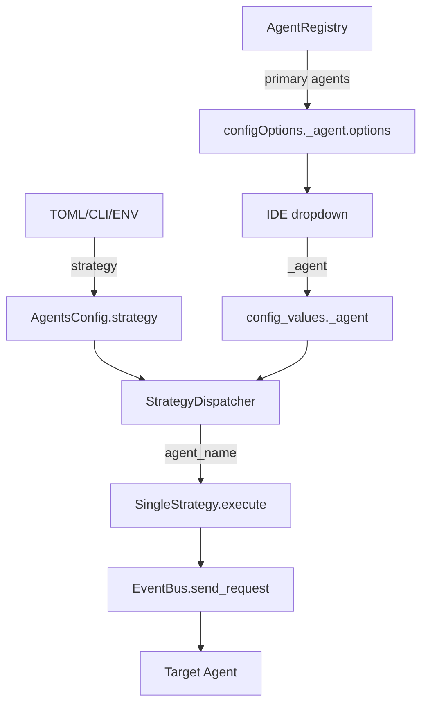

# Dynamic Strategy & Agent Selection

## Why

Текущая архитектура имеет фундаментальную проблему: `mode` в `config_values` используется для двух разных целей:
1. **Execution strategy** (single/multi_orchestrated) — как выполнять
2. **Permission behavior** (ask/code) — запрашивать ли разрешение

Это вызывает конфликт: `StrategyDispatcher._resolve_mode()` читает `config_values["mode"]` и получает `"ask"` вместо `"single"`, что приводит к ошибке `Unknown execution mode: ask`.

Кроме того, отсутствует возможность выбора конкретного агента из Registry для выполнения запроса.

## What Changes

### Архитектурное разделение ответственности

| Концепция | Уровень | Источник | ACP Config Option | Slash Override |
|-----------|---------|----------|-------------------|----------------|
| **Execution Strategy** | Server | TOML/CLI/ENV | ❌ Нет | ✅ `/strategy` |
| **Permission Mode** | Session | ACP configOption | ✅ `mode` | ✅ `/mode` |
| **Agent Selection** | Session | ACP configOption | ✅ `_agent` | ❌ Нет |

### Ключевые изменения

1. **`AgentsConfig.mode` → `AgentsConfig.strategy`** — переименование для ясности
2. **`config_values["mode"]`** — теперь только permission behavior (ask/code)
3. **`config_values["_agent"]`** — имя агента из Registry для вызова
4. **StrategyDispatcher** — получает `AgentRegistry`, динамически определяет агента
5. **Slash command `/strategy`** — runtime override execution strategy
6. **Миграция ACP** — с legacy `modes` на `configOptions`

## Capabilities

### New Capabilities

- `agent-selection`: Выбор конкретного агента из Registry через `config_values["_agent"]`
- `strategy-override`: Runtime override execution strategy через `/strategy` slash command
- `dynamic-agent-options`: Динамическое формирование списка агентов для IDE dropdown

### Modified Capabilities

- `agents-config`: `mode` → `strategy`, `fallback_mode` → `fallback_strategy`
- `session-config-options`: Добавлен `_agent` config option с динамическим списком
- `strategy-dispatcher`: Использует `AgentRegistry` для определения агента

## Impact

**Новые файлы:**
- `codelab/src/codelab/server/protocol/handlers/slash_commands/builtin/strategy.py`
- `tests/server/agent/strategies/test_dispatcher.py`
- `tests/server/protocol/handlers/slash_commands/test_strategy.py`
- `tests/server/test_strategy_integration.py`

**Изменяемые файлы:**
- `codelab/src/codelab/server/config.py` — `AgentsConfig.strategy`
- `codelab/src/codelab/server/agent/strategies/dispatcher.py` — `AgentRegistry` integration
- `codelab/src/codelab/server/protocol/handlers/strategies/single_strategy.py` — `agent_name` parameter
- `codelab/src/codelab/server/protocol/core.py` — `_build_agent_config_spec()`
- `codelab/src/codelab/server/protocol/handlers/session.py` — configOptions
- `codelab/src/codelab/server/di.py` — обновить провайдеры
- `codelab/src/codelab/server/protocol/handlers/pipeline/stages/llm_loop.py` — `strategy` parameter

**Breaking Changes:**
- TOML: `[agents] mode` → `[agents] strategy`
- Session: `config_values["mode"]` = permission mode, не execution strategy

