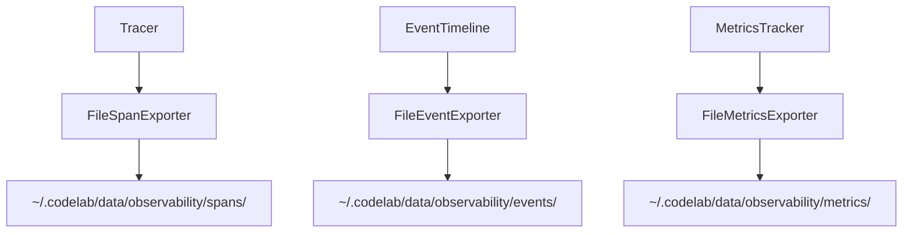

# Design: Observability File Persistence

## Проблема

Observability компоненты хранят данные только в памяти:
- `Tracer._completed_spans: list[SpanContext]`
- `EventTimeline._events: list[TimelineEvent]`
- `MetricsTracker._sessions: dict[str, SessionMetrics]`

При перезапуске сервера все данные теряются.

## Решение

Добавить file exporters для каждого компонента с periodic flush:



## Формат файлов

### Spans
```json
[
  {
    "span_id": "abc123",
    "name": "llm_call",
    "parent_id": null,
    "start_time": 1717920000.0,
    "end_time": 1717920005.0,
    "duration_ms": 5000.0,
    "session_id": "sess_xxx",
    "attributes": {"model": "gpt-4o", "input_tokens": 100}
  }
]
```

### Events
```json
[
  {
    "timestamp": 1717920000.0,
    "event_type": "AgentResponse",
    "session_id": "sess_xxx",
    "details": {"agent_name": "coder", "stop_reason": "end_turn"}
  }
]
```

### Metrics
```json
{
  "sess_xxx": {
    "llm_call_count": 5,
    "llm_total_input_tokens": 500,
    "llm_total_output_tokens": 300,
    "agent_responses": 3,
    "agent_errors": 0
  }
}
```

## Конфигурация

```toml
# codelab.toml
[observability]
enabled = true
export_dir = "~/.codelab/data/observability"
flush_interval = 60  # секунд
max_file_size = 10485760  # 10MB
```

## Flush стратегия

1. **Periodic flush** — каждые `flush_interval` секунд
2. **Session completion flush** — при завершении сессии
3. **Graceful shutdown flush** — при остановке сервера
