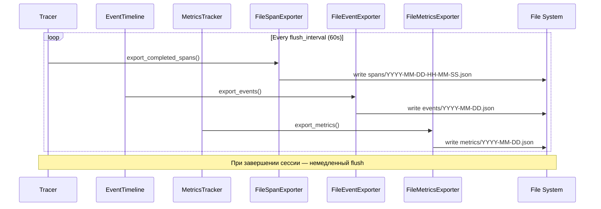

## Why

Observability компоненты (Tracer, EventTimeline, MetricsTracker) хранят данные только в памяти и теряют их при перезапуске сервера. Для production мониторинга, отладки и анализа производительности необходимо сохранять данные observability в файлы.

## What Changes

- `FileSpanExporter` — экспорт завершённых span'ов в JSON файлы
- `FileEventExporter` — экспорт событий EventTimeline в JSON файлы
- `FileMetricsExporter` — экспорт метрик в JSON файлы
- `ObservabilityConfig` — конфигурация экспорта в `codelab.toml`
- Интеграция экспортеров в DI контейнер
- Автоматический flush по интервалу или при завершении сессии

## Capabilities

### New Capabilities
- `observability-file-export`: Автоматический экспорт observability данных в файлы
- `observability-config`: Конфигурация observability в codelab.toml
- `observability-flush`: Периодический flush данных в файлы

### Modified Capabilities
- `observability`: Добавление экспортеров к существующим компонентам

## Impact

**Новые файлы:**
- `codelab/src/codelab/server/observability/exporters/file_span_exporter.py`
- `codelab/src/codelab/server/observability/exporters/file_event_exporter.py`
- `codelab/src/codelab/server/observability/exporters/file_metrics_exporter.py`
- `codelab/tests/server/observability/test_exporters.py`

**Изменяемые файлы:**
- `codelab/src/codelab/server/config.py` — ObservabilityConfig
- `codelab/src/codelab/server/di.py` — интеграция экспортеров



## Improvements Plan

### Architecture

```
┌─────────────────────────────────────────────────────────────┐
│                    Tracer / EventTimeline                    │
├─────────────────────────────────────────────────────────────┤
│  _completed_spans: list[SpanContext]                        │
│  _exported_count: int  ← NEW: количество экспортированных   │
├─────────────────────────────────────────────────────────────┤
│  get_completed_spans() → list[SpanContext]                  │
│  mark_exported(count: int) → None  ← NEW                   │
│  clear_exported() → None  ← NEW                            │
│  clear() → None  # Удалить всё (для тестов/shutdown)        │
└─────────────────────────────────────────────────────────────┘
                            │
                            ▼
┌─────────────────────────────────────────────────────────────┐
│                    FileSpanExporter                          │
├─────────────────────────────────────────────────────────────┤
│  _ensure_dir() → None  ← Ленивое создание директории        │
│  export_spans(spans) → Path | None                          │
│  flush(tracer) → Path | None                                │
│    1. spans = tracer.get_completed_spans()                  │
│    2. if not spans: return None                             │
│    3. result = self.export_spans(spans)                     │
│    4. if result: tracer.mark_exported(len(spans))           │
│    5. if result: tracer.clear_exported()                    │
│    6. return result                                         │
│  cleanup(max_age_days) → int  ← Удаление старых файлов      │
│  get_metrics() → ExportMetrics  ← Метрики экспорта          │
└─────────────────────────────────────────────────────────────┘
```

### Phase 1: Critical Fixes (🔴 Critical)

| Task | Description | Dependencies |
|------|-------------|--------------|
| 1.1 | Tracer: добавить `_exported_count`, `mark_exported()`, `clear_exported()` | — |
| 1.2 | EventTimeline: добавить `_exported_count`, `mark_exported()`, `clear_exported()` | — |
| 1.3 | FileSpanExporter: `flush()` вызывает `mark_exported()` + `clear_exported()`, добавить `cleanup()`, `get_metrics()` | 1.1 |
| 1.4 | FileEventExporter: `flush()` вызывает `mark_exported()` + `clear_exported()`, добавить `cleanup()`, `get_metrics()` | 1.2 |

**Критические исправления:**
- Убрать `mkdir` из `__init__` → ленивое создание через `_ensure_dir()`
- Изменить `flush()` — вызывать `mark_exported()` и `clear_exported()` после успешного экспорта
- Исправить `EventTimeline.clear()` — НЕ отписываться от шины, только очищать события

### Phase 2: Rotation & Cleanup (🟡 Medium)

| Task | Description | Dependencies |
|------|-------------|--------------|
| 2.1 | Span files: ротация по размеру (переименование в `.rotated`) | 1.3 |
| 2.2 | Event files: ротация по размеру (архивирование с timestamp) | 1.4 |
| 2.3 | Cleanup: удаление файлов старше N дней + `.rotated` файлов | 1.3, 1.4 |

### Phase 3: Export Metrics (🟢 Low)

| Task | Description | Dependencies |
|------|-------------|--------------|
| 3.1 | `ExportMetrics` dataclass: `total_exports`, `failed_exports`, `total_items_exported`, `last_export_time`, `last_export_size_bytes` | 1.3, 1.4 |
| 3.2 | Обновление метрик в `export_spans()` / `export_events()` | 3.1 |

### Phase 4: Data Validation (🟢 Low)

| Task | Description | Dependencies |
|------|-------------|--------------|
| 4.1 | `_validate_spans()`: пропускать span'ы без `span_id` или без `end_time` | 1.3 |
| 4.2 | `_validate_events()`: пропускать события без `event_type` или с `timestamp=0` | 1.4 |

### Tests

**Unit tests:**
- Tracer: `test_mark_exported_updates_count`, `test_clear_exported_removes_exported_spans`, `test_clear_exported_preserves_active_spans`
- EventTimeline: `test_mark_exported_updates_count`, `test_clear_exported_removes_exported_events`, `test_clear_exported_preserves_subscriptions`
- FileSpanExporter: `test_flush_calls_mark_exported_and_clear_exported`, `test_cleanup_removes_old_files`, `test_metrics_updated_on_success`
- FileEventExporter: `test_flush_calls_mark_exported_and_clear_exported`, `test_cleanup_removes_old_files`, `test_metrics_updated_on_success`

**Integration tests:**
- `test_full_export_cycle_with_multiple_flushes`
- `test_export_with_rotation`
- `test_cleanup_removes_old_files`
- `test_metrics_accuracy`

### Risks

| Risk | Probability | Impact | Mitigation |
|------|-------------|--------|------------|
| Data loss on crash | Low | High | Atomic write via tempfile |
| Race condition | Low | Medium | mark_exported + clear_exported |
| Memory leak | Medium | Medium | Periodic flush + cleanup |
| Disk full | Low | High | max_file_size limit + cleanup |

### Success Metrics

- [ ] Все unit тесты проходят
- [ ] Все интеграционные тесты проходят
- [ ] `mark_exported()` и `clear_exported()` работают корректно
- [ ] Ротация файлов работает по размеру
- [ ] Очистка старых файлов работает
- [ ] Метрики экспорта обновляются корректно
- [ ] Валидация данных работает
- [ ] Нет потери данных при сбое
- [ ] Нет race condition при параллельном экспорте
