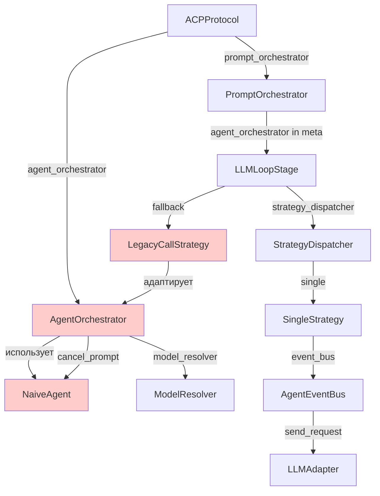
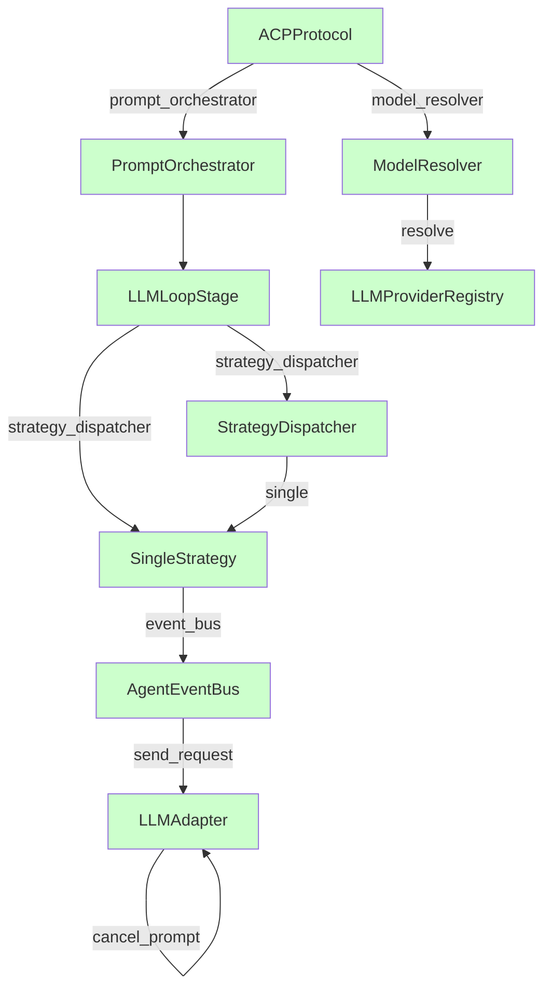
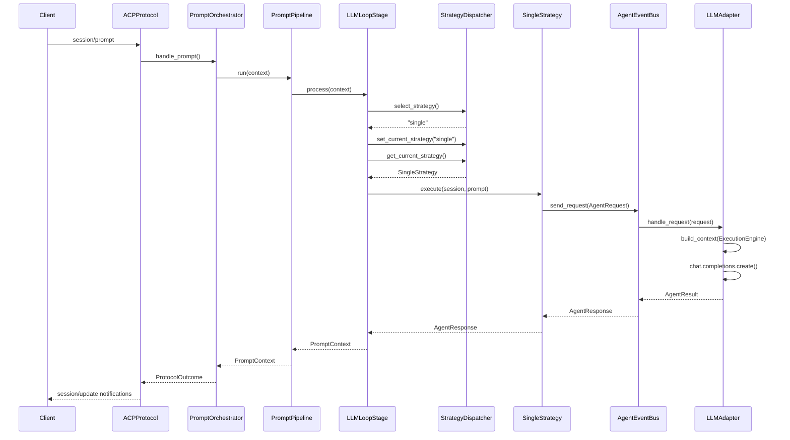

# Design: Remove Legacy Architecture

## Текущая архитектура (с legacy)



## Новая архитектура (без legacy)



## Компоненты

### 1. ModelResolver (standalone)

**Текущее состояние:** `AgentOrchestrator.model_resolver` — привязан к оркестратору.

**Новое состояние:** Отдельный компонент DI, создаётся в `RegistryProvider`.

```python
# di.py — новый провайдер
class ModelResolverProvider(Provider):
    @provide(scope=Scope.APP)
    def get_model_resolver(
        self,
        registry: LLMProviderRegistry,
        config: AppConfig,
    ) -> ModelResolver:
        return ModelResolver(
            registry=registry,
            default_provider=config.llm.provider,
            provider_configs=config.llm.providers,
        )
```

**Использование:**
- `core.py:294` — `_get_default_model()` через `model_resolver`
- `core.py:1291` — `_handle_set_config_option()` для инвалидации кэша

### 2. LLMAdapter.cancel_prompt()

**Текущее состояние:** `NaiveAgent._active_tasks` + `NaiveAgent.cancel_prompt()`.

**Новое состояние:** `LLMAdapter` уже имеет `_active_tasks` и `cancel_all()`. Нужно добавить `cancel_prompt(session_id)`.

```python
# llm_adapter.py — новый метод
async def cancel_prompt(self, session_id: str) -> None:
    """Отменить активный LLM запрос для сессии."""
    for task_id, task in list(self._active_tasks.items()):
        if not task.done():
            task.cancel()
```

**Использование:**
- `core.py:1246` — `_handle_session_cancel()` через `llm_adapter.cancel_prompt()`

### 3. PromptOrchestrator без agent_orchestrator

**Текущее состояние:** `handle_prompt()` принимает `agent_orchestrator` и кладёт в `context.meta`.

**Новое состояние:** Убрать параметр, `LLMLoopStage` всегда использует `StrategyDispatcher`.

### 4. LLMLoopStage без fallback

**Текущее состояние:** Если нет `strategy_dispatcher`, создаёт `LegacyCallStrategy(agent_orchestrator)`.

**Новое состояние:** `strategy_dispatcher` обязателен. Если нет — `ValueError`.

## Sequence Diagram: Prompt handling (новый путь)



## Migration Guide

### Для разработчиков

1. **ModelResolver** — получать из DI, не из `AgentOrchestrator`
2. **cancel_prompt** — вызывать `llm_adapter.cancel_prompt(session_id)`
3. **LLMLoopStage** — всегда передавать `strategy_dispatcher`

### Для пользователей

Никаких изменений не требуется. API ACP протокола остаётся совместимым.
