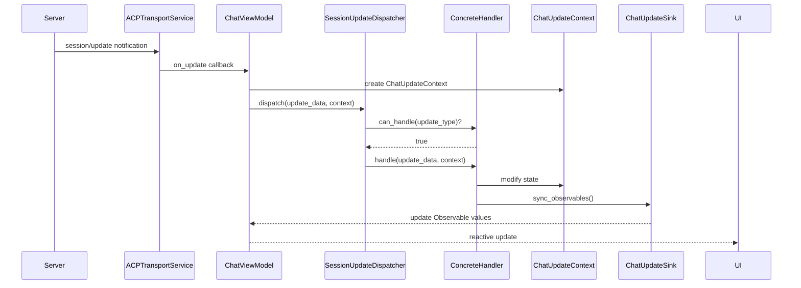
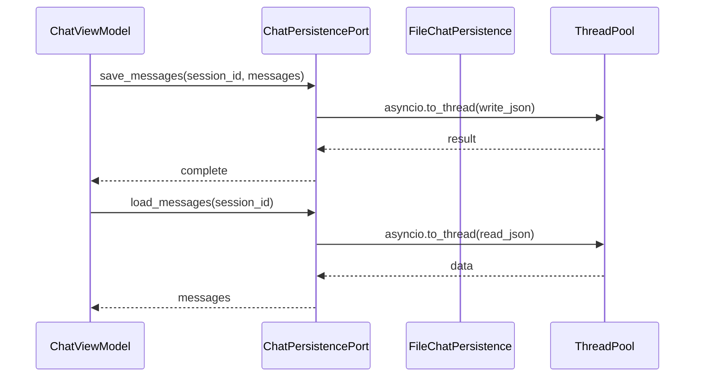
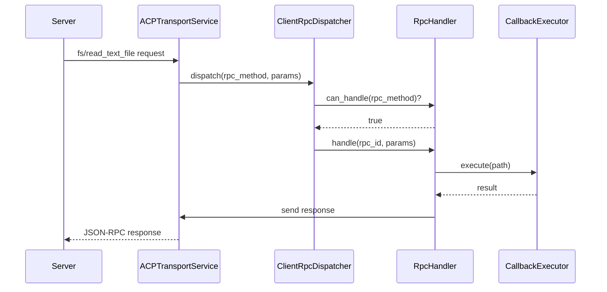

## Why

Клиентские сервисы `ChatViewModel` (1229 строк, 35 методов) и `ACPTransportService` (1321 строка, 40 методов) нарушают принципы SRP и OCP. Монолитная структура затрудняет тестирование, расширение и поддержку. Для промышленной эксплуатации требуется архитектурная декомпозиция с использованием Strategy/Dispatcher pattern для обеспечения расширяемости без модификации существующего кода.

## What Changes

- **Декомпозиция `ChatViewModel`** на специализированные компоненты:
  - `SessionUpdateDispatcher` + Strategy handlers для обработки `session/update` событий
  - `ChatPersistencePort` (Protocol) + `FileChatPersistence` для async-safe persistence
  - `FsCallbackExecutor` и `TerminalCallbackExecutor` для изоляции I/O операций
  - `ChatUpdateContext` для передачи состояния между компонентами

- **Декомпозиция `ACPTransportService`** на специализированные компоненты:
  - `ClientRpcDispatcher` для маршрутизации `fs/*` и `terminal/*` RPC
  - Специализированные handlers для каждого RPC метода
  - `RequestExecutor` для управления request/response lifecycle

- **Обновление DI контейнера** (dishka):
  - Регистрация новых компонентов в `ViewModelProvider` и `ClientProvider`
  - Автоматическая инъекция handlers в dispatcher

- **Новая структура файлов**:
  ```
  presentation/chat/
  ├── contracts.py              # Protocol интерфейсы
  ├── context.py                # ChatUpdateContext
  ├── chat_view_model.py        # Координатор (~300 строк)
  ├── dispatcher/               # SessionUpdateDispatcher
  ├── handlers/                 # Strategy handlers
  ├── persistence/              # FileChatPersistence
  └── executors/                # Fs/Terminal executors

  infrastructure/services/acp_transport/
  ├── contracts.py              # RpcHandler Protocol
  ├── acp_transport_service.py  # Координатор (~400 строк)
  ├── client_rpc_dispatcher.py  # RPC dispatcher
  ├── handlers/                 # RPC handlers
  └── request_executor.py       # Request lifecycle
  ```

## Capabilities

### New Capabilities

- `client-session-update-dispatcher`: Strategy/Dispatcher pattern для обработки `session/update` событий. Каждый тип update обрабатывается отдельным handler'ом (MessageChunkHandler, ToolCallHandler, PlanUpdateHandler, ConfigOptionHandler). Dispatcher находит handler по `update.sessionUpdate` и делегирует обработку.

- `client-chat-persistence`: Protocol-абстракция (`ChatPersistencePort`) для persistence истории чата с async-safe операциями. File-based реализация (`FileChatPersistence`) использует `asyncio.to_thread` для неблокирующего I/O. Архитектура позволяет заменить backend на SQLite/Redis без изменения ChatViewModel.

- `client-callback-executors`: Изолированные executors для `fs/*` и `terminal/*` callbacks. `FsCallbackExecutor` обеспечивает sandbox в cwd и error boundaries. `TerminalCallbackExecutor` управляет lifecycle terminal (create → output → wait → release) с кэшированием состояния.

- `client-rpc-dispatcher`: Dispatcher для маршрутизации server→client RPC запросов (`fs/read_text_file`, `fs/write_text_file`, `terminal/*`). Каждый RPC метод обрабатывается отдельным handler'ом с error boundaries и логированием.

### Modified Capabilities

_(Нет существующих capabilities, чьи REQUIREMENTS меняются)_

## Impact

### Affected Code

**Presentation Layer:**
- `src/codelab/client/presentation/chat_view_model.py` — рефакторинг в координатор
- `src/codelab/client/presentation/chat/` — новая структура (18 файлов)

**Infrastructure Layer:**
- `src/codelab/client/infrastructure/services/acp_transport_service.py` — рефакторинг в координатор
- `src/codelab/client/infrastructure/services/acp_transport/` — новая структура (10 файлов)

**DI Configuration:**
- `src/codelab/client/infrastructure/view_model_provider.py` — регистрация handlers/persistence
- `src/codelab/client/infrastructure/providers.py` — регистрация RPC handlers

**Tests:**
- `tests/client/presentation/chat/` — новые тесты для handlers/persistence/dispatcher
- `tests/client/infrastructure/services/acp_transport/` — новые тесты для RPC handlers
- Существующие тесты `test_presentation_chat_view_model.py` — обновление импортов

### Dependencies

- **dishka** — DI контейнер (уже используется)
- **Protocol** (typing) — для контрактов (уже используется)
- **asyncio.to_thread** — для async-safe I/O (стандартная библиотека)

### Breaking Changes

**Нет breaking changes.** Публичный API `ChatViewModel` и `ACPTransportService` сохраняется. Внутренняя реализация меняется, но внешние контракты остаются совместимыми.

### Migration

Пошаговая миграция с сохранением обратной совместимости:
1. Создание новых компонентов параллельно с существующим кодом
2. Делегирование из старых классов в новые компоненты
3. Обновление DI контейнера
4. Удаление старого кода после подтверждения работоспособности

## ACP Protocol Methods

Затронутые методы ACP протокола:

**Session Updates (notification):**
- `session/update` с типами:
  - `agent_message_chunk`, `user_message_chunk`
  - `tool_call`, `tool_call_update`, `tool_call_result`
  - `plan`
  - `config_option_update`
  - `session_info_update`, `current_mode_update`
  - `available_commands_update`

**Server→Client RPC:**
- `fs/read_text_file`
- `fs/write_text_file`
- `terminal/create`
- `terminal/output`
- `terminal/wait_for_exit`
- `terminal/release`
- `terminal/kill`

## Architecture Diagrams

### Session Update Flow (Strategy/Dispatcher)



### Chat Persistence Flow



### Client RPC Dispatch Flow


