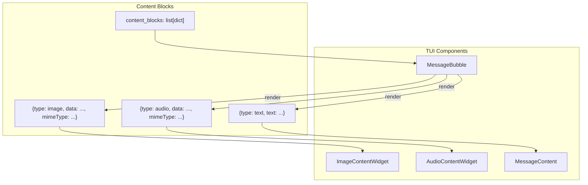

# Design: TUI Multimodal Widgets

## Архитектура



## Компоненты

### ImageContentWidget

```python
class ImageContentWidget(Vertical):
    """Placeholder для изображения в терминале."""
    
    def __init__(self, data: str, mime_type: str, uri: str | None = None):
        ...
    
    @classmethod
    def from_content_block(cls, block: dict) -> ImageContentWidget:
        ...
```

**Отображение:**
```
🖼️  [IMAGE]
Изображение
Тип: image/png | Размер: 1.5 MB
```

### AudioContentWidget

```python
class AudioContentWidget(Vertical):
    """Placeholder для аудио в терминале."""
    
    def __init__(self, data: str, mime_type: str):
        ...
    
    @classmethod
    def from_content_block(cls, block: dict) -> AudioContentWidget:
        ...
```

**Отображение:**
```
🔊  [AUDIO]
Аудио
Тип: audio/wav | Размер: 500 KB
```

### MessageBubble обновление

```python
class MessageBubble(Vertical):
    def __init__(
        self,
        role: MessageRole,
        content: str = "",
        content_blocks: list[dict] | None = None,
        ...
    ):
        ...
    
    def _render_content_blocks(self) -> ComposeResult:
        for block in self._content_blocks:
            if block["type"] == "text":
                yield MessageContent(block["text"])
            elif block["type"] == "image":
                yield ImageContentWidget.from_content_block(block)
            elif block["type"] == "audio":
                yield AudioContentWidget.from_content_block(block)
```

## Решение: Placeholder вместо реального отображения

Терминал не поддерживает отображение изображений и воспроизведение аудио, поэтому используются placeholder виджеты с информацией о контенте. Это позволяет:
1. Пользователю видеть, что агент работает с multimodal контентом
2. Видеть размер и тип файла
3. Сохранить контекст разговора
