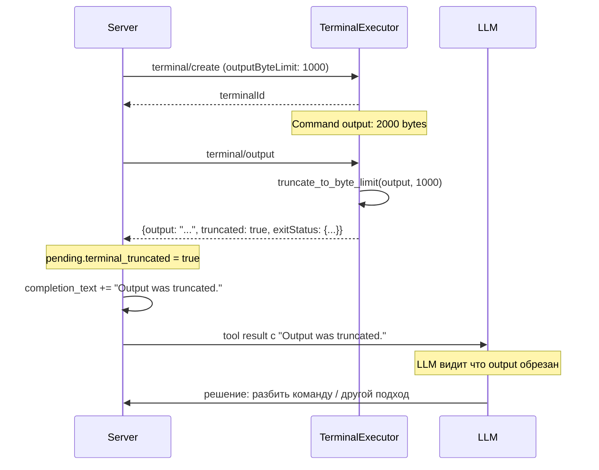

# Design: Terminal Output Truncation

## Архитектура



## Компоненты

### truncate_to_byte_limit

```python
def truncate_to_byte_limit(text: str, byte_limit: int) -> tuple[str, bool]:
    """Обрезать текст до byte_limit байт на character boundary UTF-8."""
    encoded = text.encode("utf-8")
    if len(encoded) <= byte_limit:
        return text, False
    
    # Обрезать с начала, сохраняя последние byte_limit байт
    truncated_bytes = encoded[-byte_limit:]
    
    # Декодировать, игнорируя неполные символы в начале
    truncated_text = truncated_bytes.decode("utf-8", errors="ignore")
    
    return truncated_text, True
```

**Пример:**
```
Текст: "Привет мир" (21 байт в UTF-8)
byte_limit: 12

Результат: ("мир", True)  # Последние 12 байт = "мир" (6 байт) + ...
```

### TerminalSession

```python
@dataclass
class TerminalSession:
    terminal_id: str
    command: str
    args: list[str]
    process: asyncio.subprocess.Process
    state: TerminalState
    output_buffer: list[str] = field(default_factory=list)
    exit_code: int | None = None
    output_byte_limit: int | None = None
    was_truncated: bool = False  # НОВОЕ
```

### TerminalExecutor._read_output

```python
async def _read_output(self, session: TerminalSession) -> None:
    while True:
        line = await session.process.stdout.readline()
        if not line:
            break
        
        decoded = line.decode("utf-8", errors="replace")
        session.output_buffer.append(decoded)
        
        # Применить лимит байт при необходимости
        if session.output_byte_limit is not None:
            combined = "".join(session.output_buffer)
            truncated, was_truncated = truncate_to_byte_limit(
                combined, session.output_byte_limit
            )
            if was_truncated:
                session.was_truncated = True
                session.output_buffer = [truncated]
```

### TerminalCallbackExecutor.get_output

```python
async def get_output(self, terminal_id: str) -> tuple[dict | None, str | None]:
    output, is_complete, exit_code, truncated = await self._executor.get_output(
        state.terminal_id
    )
    
    # ACP-compliant response
    output_data = {
        "output": output,
        "truncated": truncated,
    }
    
    if is_complete:
        output_data["exitStatus"] = {
            "exitCode": exit_code,
            "signal": None,
        }
    
    return output_data, None
```

### Server обработка truncated

```python
# prompt.py
if pending.terminal_truncated:
    completion_text = f"{completion_text} Output was truncated."

# Отправка клиенту
notifications.append(
    ACPMessage.notification(
        "session/update",
        {
            "sessionId": session_id,
            "update": {
                "sessionUpdate": "tool_call_update",
                "toolCallId": pending.tool_call_id,
                "status": "completed",
                "content": completed_content,
                "rawOutput": {
                    "exitCode": pending.terminal_exit_code,
                    "signal": pending.terminal_signal,
                    "truncated": pending.terminal_truncated,
                },
            },
        },
    )
)
```

## Влияние на LLM

Когда output был обрезан, LLM получает:
```
Terminal command finished with exit code 0. Output was truncated. Output: ...
```

Это позволяет LLM:
1. Понять, что output неполный
2. Принять решение (разбить команду, использовать другой подход)
3. Информировать пользователя о потере данных
