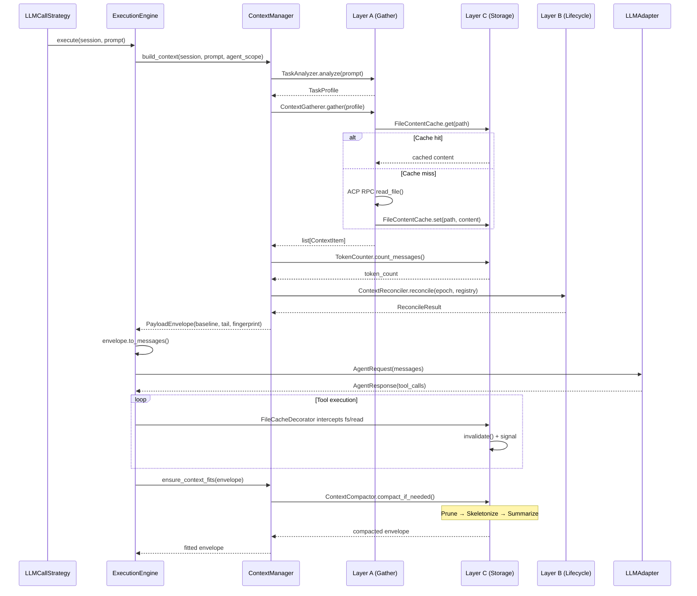

# Proposal: Context Manager Implementation

## Why

Текущая система управления контекстом в CodeLab использует legacy `ContextCompactor`, который:
- Не имеет интеллектуального сбора релевантных файлов (агент полагается на ручной выбор или простые эвристики)
- Переотправляет весь контекст каждый ход (линейный рост стоимости на длинных сессиях)
- Не имеет кэша содержимого файлов (повторные ACP RPC для тех же файлов)
- Не поддерживает AST-скелетирование кода (потеря структуры при сжатии)
- Не имеет инкрементальной модели (нет экономии на стабильном префиксе)

Консолидированный Context Manager (CM) решает эти проблемы через 4-слойную архитектуру (A-D), объединяющую два ранее независимых дизайна (CM + FCM) в единую систему.

**Почему сейчас:**
- Архитектура полностью специфицирована (18 документов в `doc/internals/context-manager/`)
- Контракты заморожены (INTERFACES.md, DATA_MODELS.md)
- Все фазы 0-6 имеют детальные спецификации (PHASE_*_SPEC.md)
- ADR-002 принят и зафиксировал решения

## What Changes

### Новая архитектура (4 слоя)

- **Слой A (Сбор):** `TaskAnalyzer` → `ContextGatherer` → `DependencyGraph` → `TokenBudgetManager`
- **Слой B (Жизненный цикл):** `ContextEpoch`, `ContextSnapshot`, `ContextReconciler`, `ConversationSummarizer`
- **Слой C (Хранение):** `FileContentCache`, `CodeSkeletonizer`, `TokenCounter`, `ContextCompactor`
- **Слой D (Мультиагент):** `ChildSessionManager`, `process_subagent_response()`

### Ключевые структуры данных

- `PayloadEnvelope` с разделением `baseline/tail` — фундамент инкрементальной модели
- `ContextItem` с priority-based eviction
- `ContextEpoch` с иммутабельным baseline + дельтами
- `ContextSnapshot` с Codec-fingerprint для детекта изменений

### Feature flags

Новая конфигурация `[agents.context.*]` с master-switch `enabled` и подфлагами для каждого слоя:
- `agents.context.gather.enabled` (Фаза 1)
- `agents.context.storage.enabled` (Фаза 2)
- `agents.context.lifecycle.incremental` (Фаза 4)
- `agents.context.multiagent.federation` (Фаза 6, кандидат на отказ)

### Фазы реализации

- **Фаза 0:** Каркас + контракты + baseline/tail форма (1 неделя)
- **Фаза 1:** MVP-сбор (слой A) (3 недели)
- **Фаза 2:** Слой C (кэш, скелет, tiktoken) (2 недели)
- **Фаза 3:** Источники + 3-фазное сжатие (1 неделя)
- **Фаза 4:** Инкрементальность (эпохи) (2 недели)
- **Фаза 5:** Полный DependencyGraph (2 недели)
- **Фаза 6:** Мультиагент (2 недели)

**Итого:** ~13 недель

## Capabilities

### New Capabilities

- `context-gather`: автоматический сбор релевантных файлов для задачи через `TaskAnalyzer` + `ContextGatherer` + `DependencyGraph`
- `context-lifecycle`: инкрементальное управление контекстом через `ContextEpoch` + `ContextSnapshot` + `ContextReconciler` (baseline/tail разделение)
- `context-storage`: кэш содержимого файлов (`FileContentCache`), AST-скелетирование (`CodeSkeletonizer`), точный подсчёт токенов (`TokenCounter`)
- `context-compaction`: 3-фазное сжатие (Prune → Skeletonize → Summarize) через `ContextCompactor` с graceful degradation
- `context-multiagent`: изоляция субагентов в child-сессиях через `ChildSessionManager`, суммаризация результатов для родителя

### Modified Capabilities

- `agent-context-models`: добавление `PayloadEnvelope`, `ContextItem`, `ContextEpoch`, `ContextSnapshot`, `ReconcileResult`, `SubagentResult`, `BudgetAllocation`, `BuildOptions`, `ContextConfig`
- `single-strategy`: интеграция с `ContextManager.build_context()` + `ensure_context_fits()` вместо прямого вызова legacy `ContextCompactor`
- `session-state`: добавление `current_agent_scope` для идентификации скоупа агента
- `agent-event-bus`: `AgentRequest` получает `messages` из `PayloadEnvelope.to_messages()` на границе с `EventBus`

## Impact

### Затрагиваемый код

**Новые файлы:**
```
src/codelab/server/agent/context/
├── manager.py            # ContextManager (единая точка входа)
├── task_analyzer.py      # TaskAnalyzer
├── gatherer.py           # ContextGatherer
├── dependency_graph.py   # DependencyGraph
├── budget.py             # TokenBudgetManager
├── registry.py           # ContextRegistry, ContextSource, SkillContextSource
├── epoch.py              # ContextEpoch
├── snapshot.py           # ContextSnapshot, ContextReconciler
├── summarizer.py         # ConversationSummarizer
├── token_counter.py      # TokenCounter, TiktokenCounter
├── ast_skeletonizer.py   # CodeSkeletonizer, PythonASTSkeletonizer
├── file_cache.py         # FileContentCache, InMemoryFileCache, SessionFileCacheRegistry
├── compactor.py          # ContextCompactor (3 фазы)
├── items.py              # ContextItem
└── child_session.py      # ChildSessionManager

src/codelab/server/tools/executors/decorators/
└── file_cache.py         # FileCacheDecorator
```

**Изменяемые файлы:**
- `src/codelab/server/agent/execution_engine.py` — единый путь `build_context()` через `ContextManager`
- `src/codelab/server/protocol/state.py` — добавление `current_agent_scope`
- `src/codelab/server/agent/base.py` — интеграция `PayloadEnvelope` в `AgentContext`

### API изменения

**Новые методы:**
- `ContextManager.build_context(session, prompt, *, agent_scope, system_prompt, options) -> PayloadEnvelope`
- `ContextManager.ensure_context_fits(envelope, *, max_context_tokens, reserved_tokens) -> PayloadEnvelope`
- `ContextManager.process_subagent_response(parent_scope, subagent_scope, response) -> SubagentResult`

**Изменения в существующих API:**
- `ExecutionEngine.build_context()` возвращает `PayloadEnvelope` (адаптер `to_messages()` на границе с `LLMAdapter`)
- `AgentContext.conversation_history` формируется через `envelope.to_messages()`

### Зависимости

**Новые зависимости:**
- `tiktoken` — для точного подсчёта токенов (опционально, fallback на `ApproximateTokenCounter`)

**Существующие зависимости:**
- `Pydantic 2.11+` — для dataclass моделей
- `structlog` — для наблюдаемости
- `aiohttp` — для ACP RPC через `ToolRegistry`

### Системы

**ACP Protocol:**
- Все tool calls (`fs/read`, `fs/write`, `project_tree`, `search`) идут через ACP `ToolRegistry`
- `ContextManager` не имеет собственного I/O (правило ADR-002)

**LLM Protocol:**
- `PayloadEnvelope.to_messages()` — единственная точка конвертации в плоский `list[LLMMessage]`
- `LLMAdapter` продолжает получать плоский список (обратная совместимость)

**Наблюдаемость:**
- 20+ метрик (`context_file_cache_hits`, `context_baseline_tokens`, `context_epoch_breaks_total`, ...)
- Spans трейсинга (`context.build`, `context.gather`, `context.compact`, `context.reconcile`)
- Structured логи с `session_id` и `agent_scope`

### Обратная совместимость

- Legacy `ContextCompactor` остаётся активным при `agents.context.enabled = false` (default)
- `ContextCompactor.compact_if_needed()` сохраняет сигнатуру для бесшовной миграции
- Feature flag `agents.context.enable_fcm` депрекейчен → алиас на `agents.context.enabled` с warning

### Риски

1. **Сложность стыка Фаза 2 ↔ Фаза 4:** единый сигнал инвалидации файла критичен для корректности baseline
2. **Детерминизм `CodeSkeletonizer`:** недетерминированный вывод рвёт prompt-cache хит
3. **Graceful degradation:** горячий путь никогда не должен падать (требование ко всем слоям)

### Митигации

- Детальные спецификации краевых случаев (EDGE_CASES.md — 14 кейсов)
- Стратегия обработки ошибок (ERROR_HANDLING.md)
- Тест-стратегия по уровням и фазам (TESTING_STRATEGY.md)
- Canary rollout с метриками и порогами отката (OBSERVABILITY.md)

## Sequence Diagram



## Success Criteria

- Все фазы 0-6 реализованы согласно спецификациям
- Legacy `ContextCompactor` работает при `enabled=false` без регрессий
- `PayloadEnvelope` — единственная форма payload в пути формирования
- Graceful degradation: горячий путь никогда не падает
- Наблюдаемость: 20+ метрик, spans, structured логи
- Canary rollout: 5% → 25% → 50% → 100% с метриками и порогами отката

## References

- [ADR-002: Консолидация двух дизайнов Context Manager](../doc/internals/architecture/adr/ADR-002-context-manager-consolidation.md)
- [CONSOLIDATED_ARCHITECTURE.md](../doc/internals/context-manager/CONSOLIDATED_ARCHITECTURE.md)
- [INTERFACES.md](../doc/internals/context-manager/INTERFACES.md)
- [DATA_MODELS.md](../doc/internals/context-manager/DATA_MODELS.md)
- [PHASE_0_SPEC.md](../doc/internals/context-manager/PHASE_0_SPEC.md) — [PHASE_6_SPEC.md](../doc/internals/context-manager/PHASE_6_SPEC.md)
