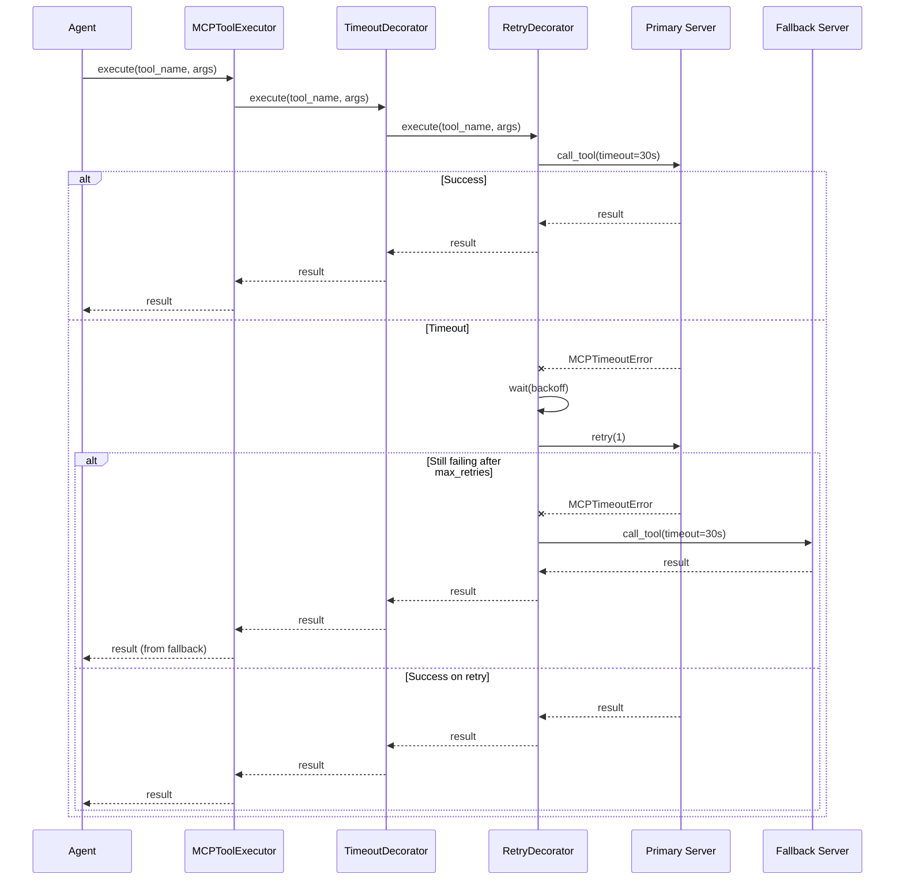

## Why

MCP инструменты критичны для работы агента, но MCP серверы могут быть нестабильны:
- Network issues (timeout, connection errors)
- Server crashes (subprocess exit)
- High latency (slow response)

Без fallback механизма сессия зависает или получает ошибку, даже если есть альтернативный сервер с теми же инструментами.

Необходим механизм:
1. **Timeout** — предотвращение бесконечного ожидания
2. **Retry** — устойчивость к временным сбоям
3. **Fallback** — автоматическое переключение на альтернативный сервер
4. **Observability** — метрики и tracing для диагностики

## What Changes

### Новые компоненты

#### Иерархия исключений
- **MCPError** — базовое исключение для MCP (наследует ToolExecutionError)
- **MCPTimeoutError** — timeout при вызове инструмента
- **MCPConnectionError** — ошибка соединения с сервером
- **MCPValidationError** — ошибка валидации аргументов
- **MCPServerError** — ошибка на стороне MCP сервера

#### Decorator Pattern для Tool Executors
- **ToolExecutorDecorator** — базовый абстрактный декоратор
- **TimeoutDecorator** — добавляет timeout через `asyncio.wait_for()`
- **RetryDecorator** — retry с exponential backoff для retryable ошибок
- **MetricsDecorator** — сбор метрик (latency, success rate, errors)
- **TracingDecorator** — создание span в span hierarchy

#### Health Check
- **MCPHealthCheckService** — периодическая проверка доступности серверов
- Observer Pattern для уведомления о изменении статуса

#### Fallback Strategy
- **FallbackStrategy** — стратегия переключения на fallback сервер
- Поддержка конфигурации fallback в `codelab.toml`

### Конфигурация

```toml
[mcp.servers.filesystem]
command = "npx"
args = ["-y", "@modelcontextprotocol/server-filesystem", "/path"]
timeout = 30.0  # секунды
max_retries = 3

# Опционально: fallback сервер
[mcp.servers.filesystem.fallback]
command = "npx"
args = ["-y", "@modelcontextprotocol/server-filesystem", "/backup"]
enabled = true
```

### Интеграция

MCPToolExecutor оборачивается в chain of decorators:

```
Base Executor → Timeout → Retry → Metrics → Tracing
```

При ошибке primary сервера:
1. TimeoutDecorator генерирует MCPTimeoutError
2. RetryDecorator пытается retry (если ошибка retryable)
3. Если все retry исчерпаны → FallbackStrategy переключает на fallback сервер
4. MetricsDecorator и TracingDecorator фиксируют все попытки

## Capabilities

### New Capabilities
- `mcp-timeout`: Timeout для MCP tool calls с настраиваемым лимитом
- `mcp-retry`: Automatic retry с exponential backoff для временных ошибок
- `mcp-fallback`: Automatic failover на fallback сервер при ошибках primary
- `mcp-health-check`: Periodic health monitoring MCP серверов
- `mcp-executor-metrics`: Метрики выполнения (latency, success rate, error count)
- `mcp-executor-tracing`: Distributed tracing для MCP tool calls

### Modified Capabilities
- `mcp-integration`: Добавлена поддержка timeout, retry, fallback
- `tool-execution`: MCP tool calls проходят через decorator chain
- `mcp-auto-reconnect`: Интеграция с health check service

## Impact

**Новые файлы:**
- `src/codelab/server/mcp/exceptions.py` — иерархия MCP исключений
- `src/codelab/server/tools/executors/decorators/__init__.py`
- `src/codelab/server/tools/executors/decorators/base.py` — базовый декоратор
- `src/codelab/server/tools/executors/decorators/timeout.py` — TimeoutDecorator
- `src/codelab/server/tools/executors/decorators/retry.py` — RetryDecorator
- `src/codelab/server/tools/executors/decorators/metrics.py` — MetricsDecorator
- `src/codelab/server/tools/executors/decorators/tracing.py` — TracingDecorator
- `src/codelab/server/mcp/health_check.py` — MCPHealthCheckService
- `src/codelab/server/mcp/fallback.py` — FallbackStrategy

**Изменяемые файлы:**
- `src/codelab/server/tools/executors/mcp_executor.py` — интеграция decorator chain
- `src/codelab/server/mcp/manager.py` — управление fallback серверами
- `src/codelab/server/mcp/models.py` — MCPServerConfig с fallback полями
- `src/codelab/server/observability/metrics_tracker.py` — tool execution метрики

**Зависимости:** Зависит от mcp-integration, observability, tool-execution.

## Sequence Diagram



## Implementation Phases

### Phase 1: Critical Fixes (Неделя 1)
- Иерархия MCP исключений
- TimeoutDecorator
- RetryDecorator
- Интеграция в MCPToolExecutor
- Тесты

**Результат:** Сессии больше не зависают, устойчивость к временным сбоям

### Phase 2: Observability (Неделя 2)
- MetricsDecorator
- TracingDecorator
- Расширение MetricsTracker для tool метрик
- Тесты

**Результат:** Видимость проблем, data-driven decisions

### Phase 3: Health Check & Fallback (Неделя 3)
- MCPHealthCheckService
- FallbackStrategy
- Конфигурация fallback серверов в MCPServerConfig
- Тесты

**Результат:** Proactive detection, graceful degradation

### Phase 4: Cache (Неделя 4)
- CacheDecorator
- CacheTTLDeterminer (автоматическое определение по категории инструмента)
- Интеграция с существующим кэшем
- Тесты

**Результат:** Снижение нагрузки на MCP серверы, ускорение выполнения

## Design Principles

### Decorator Pattern
- Каждый декоратор добавляет одну ответственность (SRP)
- Декораторы компонуются в chain (Open/Closed Principle)
- Не изменяют существующий код (Backward Compatibility)

### Retryable vs Non-Retryable Errors
- **Retryable:** MCPTimeoutError, MCPConnectionError (временные ошибки)
- **Non-Retryable:** MCPValidationError, MCPServerError (постоянные ошибки)

### Exponential Backoff
- `delay = backoff_factor ^ attempt`
- Default: `backoff_factor = 2.0`, `max_retries = 3`
- Delays: 1s → 2s → 4s

### Fallback Strategy
- Try primary → retry → fallback
- Fallback тоже может иметь retry
- Логирование всех переключений

## Testing Strategy

### Unit Tests
- Каждый декоратор тестируется изолированно
- Mock wrapped executor
- Проверка всех сценариев (success, timeout, retry, fallback)

### Integration Tests
- Цепочка декораторов
- Реальный MCP сервер (mock)
- Fallback переключение

### Performance Tests
- Overhead декораторов < 5%
- Memory footprint минимальный

## Risks and Mitigations

### Risk 1: Overhead декораторов
**Mitigation:** Benchmark тесты, оптимизация hot paths

### Risk 2: Сложность отладки
**Mitigation:** Подробное логирование, tracing integration

### Risk 3: Fallback сервер может иметь другие инструменты
**Mitigation:** Валидация совместимости при конфигурации

## Future Enhancements

### Circuit Breaker Pattern
- Если сервер упал N раз → временно отключить
- Prevents cascading failures

### Load Balancing
- Round-robin между несколькими серверами
- Weighted routing по производительности

### Smart Fallback
- Автоматический выбор fallback по latency
- Geographic distribution
