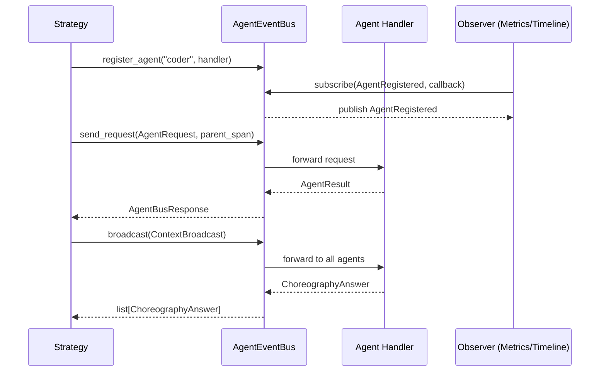

## Why

Текущая архитектура CodeLab — Single-Agent система с монолитным `AgentOrchestrator` и `NaiveAgent`. Для поддержки специализированных агентов, параллельного выполнения и делегирования необходима шина межагентской коммуникации. AgentEventBus — фундамент мультиагентной архитектуры, через который проходит всё общение между агентами (принцип "EventBus-first").

## What Changes

- Введение `AgentEventBus` — in-memory шины с двумя интерфейсами:
  - `AbstractEventBus` (pub/sub) — для observability компонентов
  - `AgentRoutingInterface` (agent routing) — для стратегий выполнения
- Контракты сообщений: `AgentRequest`, `AgentResult`, `AgentBusResponse`, `ContextBroadcast`, `ChoreographyAnswer`
  - **Примечание:** `AgentResponse` из `server/agent/base.py` НЕ заменяется — используется текущей архитектурой
  - `AgentResult` — расширенный результат для шины (включает `agent_name`, `usage`, `plan` для observability)
  - `AgentBusResponse` — обёртка ответа шины с метаданными dispatch
- Lifecycle events: `AgentRegistered`, `AgentUnregistered`, `AgentListChanged`
- Point-to-point routing (`send_request`) и broadcast (`broadcast`)
- Подписка/отписка на события с гарантией параллельного вызова обработчиков
- Retry и error handling для dispatch

## Capabilities

### New Capabilities
- `agent-event-bus`: In-memory шина межагентской коммуникации с pub/sub и routing интерфейсами
- `agent-message-contracts`: Контракты запросов, ответов и lifecycle событий для мультиагентности
- `agent-lifecycle-events`: События регистрации/удаления агентов для динамической конфигурации

### Modified Capabilities

## Impact

**Новые файлы:**
- `codelab/src/codelab/server/agent/contracts/` — AgentRequest, AgentResult, AgentBusResponse, DomainEvent, lifecycle events
- `codelab/src/codelab/server/agent/event_bus/` — AgentEventBus, AbstractEventBus, AgentRoutingInterface
- `codelab/tests/server/agent/test_event_bus.py` — тесты шины
- `codelab/tests/server/agent/test_contracts.py` — тесты контрактов

**Зависимости:** Никаких новых внешних зависимостей. Стандартная библиотека + asyncio.

**ACP boundary:** НЕ меняется. EventBus — внутренний компонент сервера, клиент не знает о мультиагентности.

