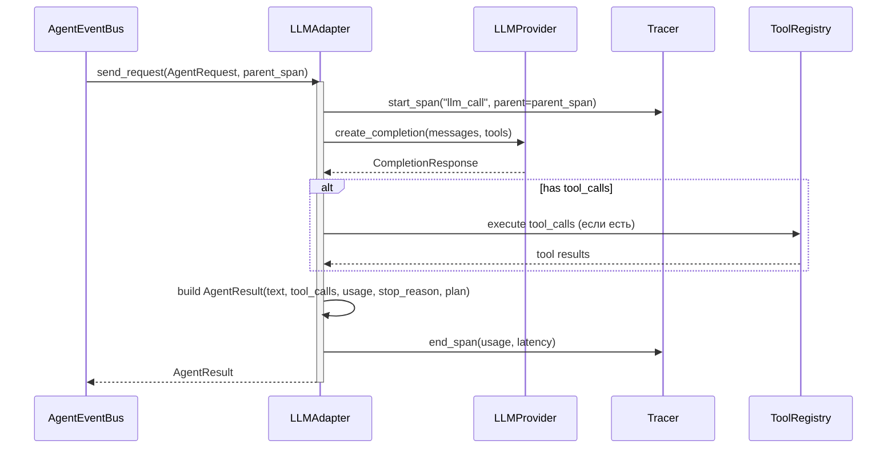

## Why

Текущий `NaiveAgent` не сохраняет `usage` (токены) в результате, не имеет tracing span'ов и не регистрируется в EventBus. Для мультиагентной архитектуры нужен единый `LLMAdapter`, реализующий `call() → AgentResult`, регистрирующийся как `RequestHandler` в шине и сохраняющий полную observability каждого LLM вызова.

## What Changes

- Новый `LLMAdapter` **заменяет** `NaiveAgent` как реализация `LLMAgent` Protocol
- Сохранение `usage` (токены) в `AgentResult` — было потеряно в NaiveAgent
- Регистрация в `AgentEventBus` как `RequestHandler` для point-to-point вызовов
- Tracer span для каждого LLM call (вложен в span стратегии)
- Timeline event recording и metrics auto-log
- **Переиспользование** существующих возможностей NaiveAgent:
  - Cancellation через `asyncio.Task` (архитектурный паттерн)
  - Tool name mapping — переиспользовать `acp_name_to_llm_name()` из `server/tools/mapping.py`
  - Plan extraction — переиспользовать `PlanExtractor` из `server/agent/plan_extractor.py`
  - Single LLM call pattern (один вызов за раз)

## Capabilities

### New Capabilities
- `llm-adapter`: Единый LLM-агент через Agent Protocol, замена NaiveAgent
- `agent-result-usage`: Сохранение token usage в AgentResult для observability
- `llm-tracing`: Tracer span для каждого LLM вызова

### Modified Capabilities

## Impact

**Новые файлы:**
- `codelab/src/codelab/server/agent/llm_adapter.py` — LLMAdapter класс
- `codelab/tests/server/agent/test_llm_adapter.py` — тесты LLMAdapter

**Переиспользуемые файлы (без изменений):**
- `codelab/src/codelab/server/tools/mapping.py` — acp_name_to_llm_name(), llm_name_to_acp_name()
- `codelab/src/codelab/server/agent/plan_extractor.py` — PlanExtractor
- `codelab/src/codelab/server/llm/models.py` — LLMMessage, LLMToolCall, CompletionRequest, CompletionResponse
- `codelab/src/codelab/server/llm/base.py` — LLMProvider ABC
- `codelab/src/codelab/server/tools/base.py` — ToolDefinition, ToolRegistry

**Удаляемые файлы (после миграции):**
- `codelab/src/codelab/server/agent/naive.py` — NaiveAgent (заменяется LLMAdapter)

**Зависимости:** Зависит от `multiagent-event-bus` (AgentEventBus, контракты).

