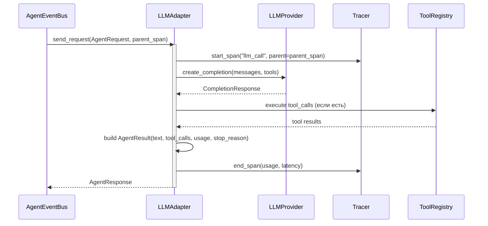

## Why

Текущий `NaiveAgent` не сохраняет `usage` (токены) в результате, не имеет tracing span'ов и не регистрируется в EventBus. Для мультиагентной архитектуры нужен единый `LLMAdapter`, реализующий `Agent.call() → AgentResult`, регистрирующийся как `RequestHandler` в шине и сохраняющий полную observability каждого LLM вызова.

## What Changes

- Новый `LLMAdapter` заменяет `NaiveAgent` как реализация `Agent` Protocol
- Сохранение `usage` (токены) в `AgentResult` — было потеряно в NaiveAgent
- Регистрация в `AgentEventBus` как `RequestHandler` для point-to-point вызовов
- Tracer span для каждого LLM call (вложен в span стратегии)
- Timeline event recording и metrics auto-log
- Сохранение существующих возможностей NaiveAgent:
  - Cancellation через `asyncio.Task`
  - Tool name mapping (ACP `/` → LLM `_`)
  - Plan extraction
  - Single LLM call pattern

## Capabilities

### New Capabilities
- `llm-adapter`: Единый LLM-агент через Agent Protocol, замена NaiveAgent
- `agent-result-usage`: Сохранение token usage в AgentResult для observability
- `llm-tracing`: Tracer span для каждого LLM вызова

### Modified Capabilities

## Impact

**Новые файлы:**
- `codelab/src/codelab/server/agent/llm_adapter.py` — LLMAdapter класс
- `codelab/tests/server/agent/test_llm_adapter.py` — тесты LLMAdapter

**Изменяемые файлы:**
- `codelab/src/codelab/server/agent/naive.py` — NaiveAgent (deprecated, не удаляется сразу)
- `codelab/src/codelab/server/agent/orchestrator.py` — интеграция с ExecutionEngine

**Зависимости:** Зависит от `multiagent-event-bus` (AgentEventBus, контракты).

