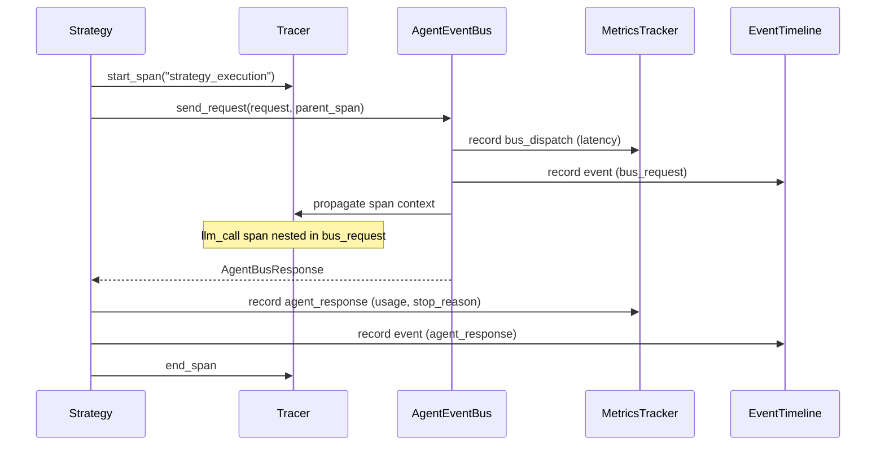

## Why

Мультиагентная система требует встроенной observability для отладки, мониторинга и анализа производительности. Tracing, timeline событий и метрики должны быть pluggable — с возможностью подключения external backends (OpenTelemetry, Langfuse) post-MVP.

## What Changes

- `Tracer` — span hierarchy с context propagation между стратегиями и EventBus
- `EventTimeline` — хронология событий сессии для debug mode
- `MetricsTracker` — автолог метрик (token usage, latency, compression ratio, strategy execution time)
- Подписка на события EventBus (`AbstractEventBus`) для автоматического сбора метрик
- Debug mode — полные payload логи, LLM dump
- Span attributes: original_tokens, compacted_tokens, compression_ratio, compaction_latency_ms
- Структура трейсов: `strategy_execution → bus_request → llm_call` (единая для всех стратегий)

## Capabilities

### New Capabilities
- `agent-tracing`: Span hierarchy и context propagation для мультиагентных вызовов
- `event-timeline`: Хронология событий сессии для debug и observability
- `agent-metrics`: Автоматический сбор метрик (tokens, latency, compression)
- `debug-mode`: Полные payload логи и LLM dump для отладки

### Modified Capabilities

## Impact

**Новые файлы:**
- `codelab/src/codelab/server/observability/tracer.py` — Tracer, SpanContext
- `codelab/src/codelab/server/observability/event_timeline.py` — EventTimeline
- `codelab/src/codelab/server/observability/metrics_tracker.py` — MetricsTracker
- `codelab/tests/server/observability/test_tracer.py`
- `codelab/tests/server/observability/test_event_timeline.py`
- `codelab/tests/server/observability/test_metrics_tracker.py`

**Зависимости:** Зависит от `multiagent-event-bus` (подписка на AbstractEventBus).

