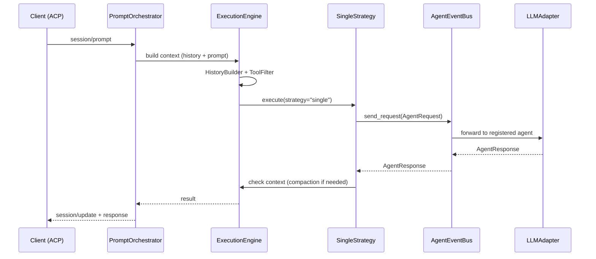

## Why

Базовая стратегия выполнения — SingleStrategy — необходима как первый working baseline мультиагентной архитектуры. Она вызывает единственного агента через EventBus, обеспечивает минимальную задержку и служит бенчмарком для сравнения с другими стратегиями. Также требуется замена монолитного `AgentOrchestrator` на композиционный `ExecutionEngine`.

## What Changes

- `SingleStrategy` — вызов агента через `EventBus.send_request()`, uniformity со всеми стратегиями
- `ExecutionEngine` — замена `AgentOrchestrator`, композиция компонентов:
  - `HistoryBuilder` — конвертация session.history → LLMMessage
  - `ToolFilter` — фильтрация по client capabilities
  - `MessageSanitizer` — восстановление orphaned tool calls
  - `PlanExtractor` — извлечение плана из LLM response
- Интеграция с существующим `PromptOrchestrator` / Pipeline
- Compaction fallback для длинных сессий:
  - Prune — удаление старых tool outputs (FIFO, без LLM)
  - LLM Summarize — сжатие conversation если prune недостаточно
- Управление контекстом: `context_window_limit`, `compaction_reserved_tokens`

## Capabilities

### New Capabilities
- `single-strategy`: Базовая стратегия выполнения через EventBus
- `execution-engine`: Композиционный движок выполнения (замена AgentOrchestrator)
- `context-compaction`: Двухфазное сжатие контекста (Prune + LLM Summarize)
- `history-builder`: Конвертация SessionState history → LLMMessage
- `tool-filter`: Фильтрация инструментов по client capabilities

### Modified Capabilities
- `codelab`: Интеграция ExecutionEngine в PromptOrchestrator pipeline

## Impact

**Новые файлы:**
- `codelab/src/codelab/server/protocol/handlers/strategies/single_strategy.py`
- `codelab/src/codelab/server/agent/execution_engine.py` — ExecutionEngine
- `codelab/src/codelab/server/agent/history_builder.py`
- `codelab/src/codelab/server/agent/tool_filter.py`
- `codelab/src/codelab/server/agent/message_sanitizer.py`
- `codelab/src/codelab/server/agent/context_compactor.py` — ContextCompactor
- `codelab/tests/server/strategies/test_single_strategy.py`
- `codelab/tests/server/agent/test_execution_engine.py`
- `codelab/tests/server/agent/test_context_compactor.py`

**Изменяемые файлы:**
- `codelab/src/codelab/server/protocol/handlers/prompt_orchestrator.py` — интеграция ExecutionEngine

**Зависимости:** Зависит от `multiagent-event-bus`, `multiagent-llm-adapter`, `multiagent-agent-registry`.

