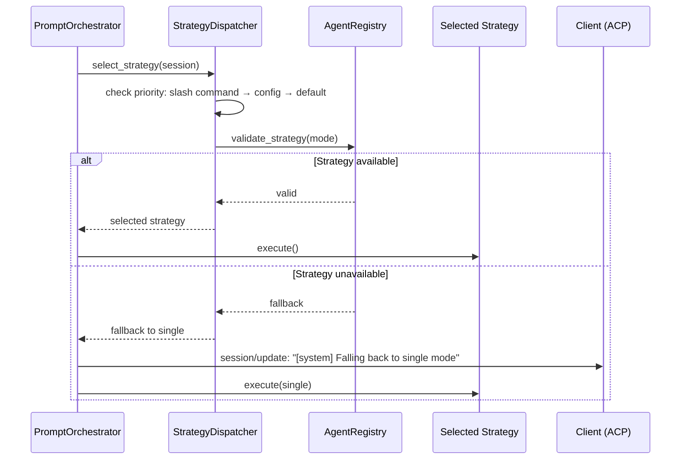

## Why

Мультиагентная система поддерживает 4 стратегии выполнения (single, orchestrated, choreography, hierarchical). Необходим компонент маршрутизации, который выбирает стратегию на основе конфигурации, доступных агентов и slash-команд, с fallback на single при недоступности выбранной стратегии.

## What Changes

- `StrategyDispatcher` — выбор стратегии по приоритету:
  1. Slash command override (`context.meta["routing_mode"]`)
  2. Config value (`config_values["_routing_mode"]`) — persistent режим сессии
  3. Default (`"single"`) — fallback
- Валидация совместимости mode + стратегия через `AgentRegistry`:
  - Single — всегда доступно
  - Orchestrated — требует orchestrator + subagent
  - Choreography — требует ≥2 subagents
  - Hierarchical — требует primary + subagent
- Fallback на `global.fallback_mode` при недоступности стратегии
- Уведомление пользователю при fallback через `session/update` (agent_message_chunk)
- Config option `_routing_mode` для persistent режима сессии

## Capabilities

### New Capabilities
- `strategy-dispatcher`: Маршрутизация между стратегиями выполнения
- `strategy-validation`: Валидация совместимости mode + доступных агентов
- `routing-mode-config`: Конфигурация режима выполнения (slash command + config option)
- `strategy-fallback`: Fallback на single при недоступности стратегии с уведомлением

### Modified Capabilities
- `codelab`: Добавление config option `_routing_mode`, интеграция в prompt pipeline

## Impact

**Новые файлы:**
- `codelab/src/codelab/server/protocol/handlers/strategies/strategy_dispatcher.py`
- `codelab/tests/server/strategies/test_strategy_dispatcher.py`

**Изменяемые файлы:**
- `codelab/src/codelab/server/protocol/handlers/prompt_orchestrator.py` — интеграция StrategyDispatcher
- `codelab/src/codelab/server/protocol/state.py` — config option `_routing_mode`

**Зависимости:** Зависит от всех предыдущих changes (event-bus, llm-adapter, agent-registry, single-strategy, observability).

