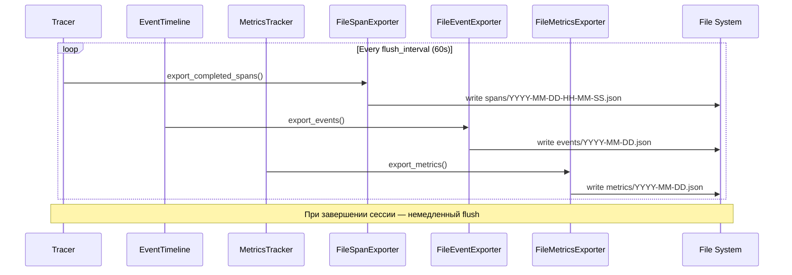

## Why

Observability компоненты (Tracer, EventTimeline, MetricsTracker) хранят данные только в памяти и теряют их при перезапуске сервера. Для production мониторинга, отладки и анализа производительности необходимо сохранять данные observability в файлы.

## What Changes

- `FileSpanExporter` — экспорт завершённых span'ов в JSON файлы
- `FileEventExporter` — экспорт событий EventTimeline в JSON файлы
- `FileMetricsExporter` — экспорт метрик в JSON файлы
- `ObservabilityConfig` — конфигурация экспорта в `codelab.toml`
- Интеграция экспортеров в DI контейнер
- Автоматический flush по интервалу или при завершении сессии

## Capabilities

### New Capabilities
- `observability-file-export`: Автоматический экспорт observability данных в файлы
- `observability-config`: Конфигурация observability в codelab.toml
- `observability-flush`: Периодический flush данных в файлы

### Modified Capabilities
- `observability`: Добавление экспортеров к существующим компонентам

## Impact

**Новые файлы:**
- `codelab/src/codelab/server/observability/exporters/file_span_exporter.py`
- `codelab/src/codelab/server/observability/exporters/file_event_exporter.py`
- `codelab/src/codelab/server/observability/exporters/file_metrics_exporter.py`
- `codelab/tests/server/observability/test_exporters.py`

**Изменяемые файлы:**
- `codelab/src/codelab/server/config.py` — ObservabilityConfig
- `codelab/src/codelab/server/di.py` — интеграция экспортеров

