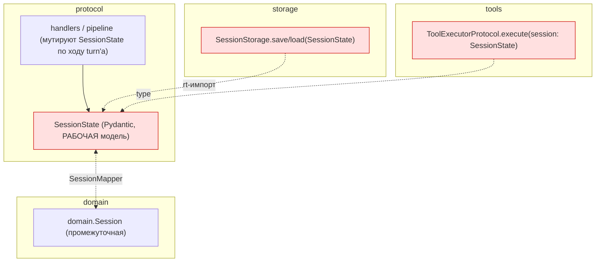
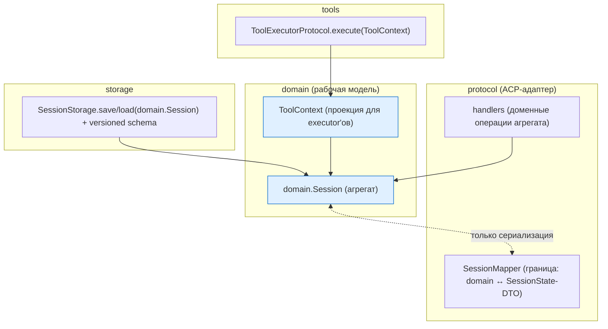

# Design: Write-фаза доменной миграции сессии

Технический дизайн эпика write-фазы (Workstream D плана ADR-005). Основание: ADR-006 (решение),
ADR-003 (вариант B), ADR-005 (read-фаза, порты).

## Принципы

1. `domain.Session` — рабочий агрегат; `SessionState` — сериализационный DTO на границе.
2. Единственная точка конвертации — `SessionMapper`; round-trip без потерь (гейт).
3. Изменение формата хранения — с миграцией (versioned schema, upgrade на чтении).
4. Wire `session/update` — байт-в-байт (golden-гейт перед любыми правками эмиссии).
5. Инкрементально, каждый шаг за `make check` + import-linter.

## Как сейчас (as-is)

## Как будет (to-be)

## Ключевые решения

### `SessionMapper` симметричность
Round-trip `domain.Session → SessionState → domain.Session` без потерь. Известная асимметрия —
схлопывание `MessageRole.TOOL → assistant` в `to_protocol`; довести до сохранения роли/tool_call_id.
Гейт: property-тест round-trip на репрезентативных сессиях (история с tool_calls, plan, multimodal).

### Формат хранения + миграция
`SessionStorage` сериализует `domain.Session`. Схема версионируется (`schema_version`); на чтении
старые версии (текущий `SessionState`-JSON) распознаются и апгрейдятся через `SessionMapper.to_domain`.
Существующие `~/.codelab/.../sessions` читаются без потерь; запись — в новом формате.

### `ToolContext`
Executor'ам нужна поверхность шире read-`SessionView`: `cwd`, permission-policy, `active_turn`,
client-RPC state. Вводится доменный `ToolContext` (проекция агрегата или сам агрегат), `ToolExecutorProtocol.execute`
ретайпится с него. `file_cache_decorator` использует его же → теряет `protocol.state`.

### Мутации по ходу turn-а
Хендлеры сейчас пишут в `SessionState.active_turn`/`history`/… напрямую. Переводятся на доменные
операции `domain.Session`. Это самая рискованная часть (горячий путь) — идёт по под-состояниям,
каждое за тестами поведения.

## Риски и решения

- **Горячий путь + мутации** — крупнейший риск; дробить по под-состояниям (`active_turn`, `history`,
  `tool_calls`, `plan`), byte-identity wire как страховка.
- **Миграция формата** — тесты на реальных старых сессиях; upgrade-путь обязателен.
- **`SessionMapper` на горячем пути** — стоимость конвертации; замерять, при необходимости —
  ленивые проекции.
- **Consumer-driven порты** — форму `AgentRunner`/`UpdateSink` доводит fake driver (Workstream E),
  не спекуляция.

## План работ (staged, механизм M2)

> Порядок эпика: **D0 → D1 → D4 → D2 → D3 → D5** (реордер, см. ADR-006 finding: тип
> storage/tools следует за рабочей моделью). Механизм D4 — **M2**: рабочая модель
> флипается по стадиям пайплайна (threaded `context.session` → `domain.Session`), а не
> по под-стейтам гибридного DTO (M1 отклонён). На время миграции — **транзиентный
> scaffold** (dual-carry SessionState↔domain), снимается в D4-d.

### D4 — рабочая модель → `domain.Session` (ядро)

**D4-a. Граница: конструирование `domain.Session` (аддитивно)**
- Работа: на входе turn-а строить `domain.Session` из `SessionState` через `SessionMapper.to_domain`;
  положить в `PromptContext` как `domain_session` (новое поле). `SessionState` — пока source-of-truth,
  сохраняется как есть. Потребителей нет.
- Гейт: аддитивно, поведение не меняется; golden-wire + round-trip + `make check`.

**D4-b. Миграция ЧТЕНИЙ по под-стейтам (изолированные первыми)**
- b1 `plan` (1 read-site) → `domain_session.plan` + `PlanMapper`.
- b2 `tool_calls` (3) → `domain_session.tool_calls`.
- b3 `history` (5) → `domain_session.history`.
- b4 `active_turn` (7) → доменная проекция turn-состояния.
- Гейт каждого b: чтения дают идентичные значения; golden-wire + round-trip + `make check`.

**D4-c. Миграция ЗАПИСЕЙ (мутаций) по тем же под-стейтам**
- Мутации → доменные операции (`plan.add_step`, `tool_calls.create/update`, `history.add`, turn-переходы);
  `SessionState`-проекция пересобирается из домена на границе (пока dual-carry).
- Порядок: plan → tool_calls → history → **active_turn последним** (pause/resume, permission, client-RPC).
- Гейт: golden-wire байт-в-байт; permission-flow (pause/resume) на live-smoke; `make check`.

**D4-d. Флип source-of-truth + снятие scaffold**
- `context.session` = `domain.Session`; `SessionState` строится только на границе wire/storage через
  `SessionMapper.to_protocol`; dual-carry убран; сигнатуры pipeline-стадий → `domain.Session`.
- Гейт: golden-wire + round-trip; live-smoke полного turn-а (стриминг + permission + tool-calling);
  immediate-delivery сохранён; `make check`.

### D2 — storage на `domain.Session` + миграция (после D4)
- D2.1 `SessionStorage` (ABC + `JsonFile`/`InMemory`/`Cached`) на `domain.Session`.
- D2.2 versioned schema; чтение старого v6 `SessionState`-JSON → upgrade через `SessionMapper.to_domain`; запись — v7.
- D2.3 фикстура v6 (D0.3) читается без потерь; добавить v7 round-trip.
- D2.4 multimodal контент истории (блоки) — снять `xfail`.
- D2.5 снять `ignore_imports` `storage.base -> protocol.state`.

### D3 — `ToolContext` для executor'ов (после D4)
- D3.1 доменный `ToolContext` (cwd, permission, active_turn, client-RPC).
- D3.2 `ToolExecutorProtocol.execute(ToolContext)`; перевести `fs`/`terminal`/`plan`/`mcp`.
- D3.3 `file_cache_decorator` на `ToolContext` → снять оба `ignore_imports` (file_cache + decorators.base).

### D5 — capabilities + закрытие ADR-003
- D5.1 унифицировать `ClientRuntimeCapabilities` ↔ `shared.ClientCapabilities` (P2-32).
- D5.2 `ignore_imports` пуст для `agent`/`storage`/`tools`.
- D5.3 ADR-003 закрыт; обновить ADR-003/005/006, `tech-debt.md`, `ARCHITECTURE.md`.

### Разблокируется после write-фазы (ADR-005)
- **B** — доменная эмиссия `UpdateSink` (перенос 3.3/3.4), golden-wire гейт.
- **C** — прод turn-loop через `AgentRunner` (4.3), поверх доменного `active_turn`.
- **E** — fake driver как полноценный не-ACP адаптер (валидирует порты end-to-end).

### Сквозные правила
1. Гейт до коммита: golden-wire (D0.1) + round-trip (D0.2) + `make check`.
2. Атомарные коммиты по стадиям (b1, b2, …) со ссылкой на ADR-006.
3. Байт-идентичность wire — жёстко; форматы сессий — только с миграцией.
4. Транзиентный scaffold (dual-carry) помечать явно, снять в D4-d.
5. После каждого этапа — анализ `~/.codelab/logs` на регрессии живого пути.

## Вне области

- Прод turn-loop через `AgentRunner` (ADR-005 Workstream C) — после этого эпика.
- Доменная эмиссия `UpdateSink` (ADR-005 3.3/3.4, Workstream B) — после/параллельно C.
- Второй реальный драйвер (A2A) — отдельно; здесь только fake driver как потребитель.
