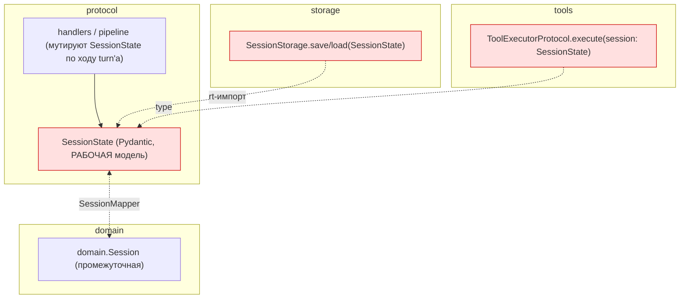
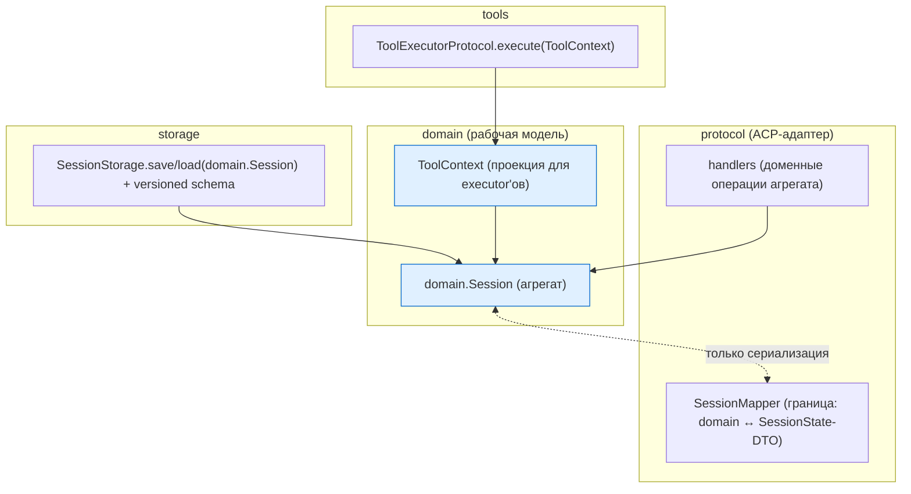

# Design: Write-фаза доменной миграции сессии

Технический дизайн эпика write-фазы (Workstream D плана ADR-005). Основание: ADR-006 (решение),
ADR-003 (вариант B), ADR-005 (read-фаза, порты).

## Принципы

1. `domain.Session` — рабочий агрегат; `SessionState` — сериализационный DTO на границе.
2. Единственная точка конвертации — `SessionMapper`; round-trip без потерь (гейт).
3. Изменение формата хранения — с миграцией (versioned schema, upgrade на чтении).
4. Wire `session/update` — байт-в-байт (golden-гейт перед любыми правками эмиссии).
5. Инкрементально, каждый шаг за `make check` + import-linter.

## Как сейчас (as-is)

## Как будет (to-be)

## Ключевые решения

### `SessionMapper` симметричность
Round-trip `domain.Session → SessionState → domain.Session` без потерь. Известная асимметрия —
схлопывание `MessageRole.TOOL → assistant` в `to_protocol`; довести до сохранения роли/tool_call_id.
Гейт: property-тест round-trip на репрезентативных сессиях (история с tool_calls, plan, multimodal).

### Формат хранения + миграция
`domain.Session` — **полная** модель (агрегат + `TurnState`/`SessionRuntime` VO, см. «Природа
остатка»), поэтому персистируемое состояние (`active_turn`/`events_history`/`terminals`/
`session_metrics`) **входит в сам агрегат** и не теряется при `save(domain.Session)`.
`storage.base` типизируется на `domain.Session` → импорт `protocol.state` уходит (**D2.5 достижим**).
Сериализация — через `SessionMapper`/codec самого `domain.Session`; схема версионируется
(`schema_version`), на чтении старые версии (`SessionState`-JSON v6) апгрейдятся в `domain.Session`
через `SessionMapper.to_domain`. Существующие `~/.codelab/.../sessions` читаются без потерь (гейт D0.3);
запись — новый формат (v7). `SessionState` низводится до тонкого wire-DTO для ACP-подмножества
(session/load replay, init capabilities), живёт в `protocol`.

### `ToolContext`
Executor'ам нужна поверхность шире read-`SessionView`: `cwd`, permission-policy, `active_turn`,
client-RPC state. Вводится доменный `ToolContext` (проекция агрегата или сам агрегат), `ToolExecutorProtocol.execute`
ретайпится с него. `file_cache_decorator` использует его же → теряет `protocol.state`.

### Мутации по ходу turn-а
Хендлеры сейчас пишут в `SessionState.active_turn`/`history`/… напрямую. Переводятся на доменные
операции `domain.Session`. Это самая рискованная часть (горячий путь) — идёт по под-состояниям,
каждое за тестами поведения.

### Природа «остатка»: состояние сессии, мис-хоумленное в `protocol/state.py`
Рамка «протокольный runtime-остаток» **отвергнута** (см. ADR-006). Проверка `state.py`: поля вроде
`active_turn` (`phase: str`, id как `str|int`, `pending_client_request` — опаковый dict), `terminals:
dict[str,str]`, `events_history: list[dict]`, `session_metrics` (числа) — **плоские данные без wire-логики
ACP**. Это **состояние сессии**, чей ТИП случайно объявлен в `protocol/state.py`, а не протокол.

**Различать по СЕМАНТИКЕ, не по текущему месту определения:**
- **Состояние сессии** (что произошло, где мы в turn-е, какие терминалы открыты) → **доменный VO**,
  даже если тип сегодня в `protocol/state.py`. Переезжает в `domain`.
- **Wire-framing** (как ACP-запрос/нотификация кодируется в JSON-RPC) → остаётся в `protocol` как DTO.

Инвариант «протокол в домен не течёт» **не нарушается**: в домен переезжают ДАННЫЕ (dict/str/int),
не wire-семантика. `active_turn` = доменное «сессия ждёт внешний запрос X, фаза Y»; id — опаковый
resume-токен; переотправление запроса после рестарта — протокол.

**Классификация полей `SessionState` по семантике (D4-a, финализирована по карте D4.1):**

| Класс | Поля | Статус |
|---|---|---|
| Доменный агрегат (дом есть) | `session_id`→`id`; `cwd`/`config_values`/`runtime_capabilities`/`active_strategy`→`SessionConfig`; `history`→`ConversationHistory`; `tool_calls`/`tool_call_counter`→`ToolCallRegistry`; `latest_plan`→`AgentPlan`; `permission_policy`/`cancelled_permission_requests`→`PermissionState`; `active_agents`/`parent_session_id`/`child_session_ids`/`is_child_session`→`MultiAgentState` | было в `domain.Session` |
| **Домен, новые VO** (плоские данные — переехали из `protocol.state`) | `active_turn`→`TurnState` VO (phase: str, cancel_requested, resume-id `str\|int`, `pending_external_request: dict` опаковый); `terminals`/`terminal_counter`, `events_history`, `session_metrics` (опаковый dict), `correlation_id`, `cancelled_client_rpc_requests`, `pending_prompt_response` (опаковый dict) → `SessionRuntime` VO | **добавлены в D4-a** |
| Wire-DTO / transient (остаётся в `protocol`) | `mcp_prompt_handlers` (`exclude=True`, transient — подтверждено: очищается после переноса в runtime-компаньон); `available_commands` (ACP slash-command структуры — подтверждено wire-DTO: наполняется для `available_commands_update`) | в `protocol` |
| storage-мета | `schema_version`, `updated_at`, `title` | сериализация `domain.Session` (D2) |
| Мёртвые (кандидаты на удаление) | `task_result`, `sliced_summary` (0 сайтов); `session_metrics`, `correlation_id` (0 рантайм-сайтов — проверить наполнение) | решить в D4-b/D5 |
| Долги дублирования (закрыть при флипе) | `active_strategy` ↔ `config_values["_active_strategy"]`; tool_call-мутатор в `tool_call_handler.py` ≡ `prompt/tool_calls.py` | — |

**Дом состояния — `domain`, НЕ компаньон в `protocol`.** `domain.Session` становится ПОЛНОЙ рабочей+
персистируемой моделью (агрегат + `TurnState`/`SessionRuntime` VO). Компаньон-в-`protocol` **отменён**:
он не снял бы ребро (`storage.base → …companion… → protocol`), а лишь переместил. `agent.core` чист
(`agent → domain`). `ToolContext` (D3) проецируется из `domain.Session`.

**Персистентность — ортогональная ось.** Turn-scoped ≠ transient: `active_turn`/`pending_prompt_response`/
`cancelled_client_rpc_requests` персистятся для восстановления pending-permission после рестарта.
Единственный чисто transient — `mcp_prompt_handlers` (`exclude=True`). Персистируемое состояние — часть
сериализации самого `domain.Session` (см. «Формат хранения»).

### Паттерны и единица тридинга
- **Aggregate Root (DDD)** — `domain.Session`: полная модель (состояние сессии + turn-runtime как
  доменные VO), доменные инварианты и операции. Тредится одной ссылкой (`context.session`).
- **Repository** — `SessionStorage` над `domain.Session`; `JsonFile`/`InMemory` + **Decorator** `CachedStorage`.
- **Anti-Corruption / Mapper** — `SessionMapper`: `domain.Session` ↔ хранимая/wire-форма; апгрейд версий.
- **Wire-DTO** — `SessionState` (в `protocol`): тонкий маппинг для ACP-подмножества (replay/init).
  Golden-фикстуры версий = тесты сериализации `domain.Session`.
- **Adapter** — `ToolContext` (D3): проекция из `domain.Session` для executor'ов.

> `SessionContext`/`SessionRuntime`-компаньон в `protocol` — **отменён**: состояние сессии живёт в
> `domain.Session`, отдельная threaded-обёртка не нужна (см. «Природа остатка», ADR-006).

### `ToolCallState` богаче доменного `ToolCall`
Wire-модель `ToolCallState` шире `ToolCall`; на b2/D4-c решить по каждому полю, гейт — байт-идентичность
tool_call/tool_call_update:
- **wire-only** (нет дома; остаётся полем DTO, восстанавливается маппером): `title`, `kind`,
  `tool_call_id_from_llm`, `raw_input`.
- **есть доменный дом** (`ToolCall` уже несёт): `locations`, `raw_output`, `status`, `tool_name`→,
  `tool_arguments`→`arguments`.
- **mapping-решение** (домен `ToolCall.result` vs wire `content`/`result_content`): выбрать
  представление результата в VO и правило маппинга в оба ACP-поля.

## Риски и решения

- **Горячий путь + мутации** — крупнейший риск; дробить по под-состояниям (`active_turn`, `history`,
  `tool_calls`, `plan`), byte-identity wire как страховка.
- **Миграция формата** — тесты на реальных старых сессиях; upgrade-путь обязателен.
- **`SessionMapper` на горячем пути** — стоимость конвертации; замерять, при необходимости —
  ленивые проекции.
- **Consumer-driven порты** — форму `AgentRunner`/`UpdateSink` доводит fake driver (Workstream E),
  не спекуляция.

## План работ (staged, механизм M2)

> Порядок эпика: **D0 → D1 → D4 → D2 → D3 → D5** (реордер, см. ADR-006 finding: тип
> storage/tools следует за рабочей моделью). Механизм D4 — **M2**: рабочая модель
> флипается по стадиям пайплайна (threaded `context.session` → `domain.Session`), а не
> по под-стейтам гибридного DTO (M1 отклонён). На время миграции — **транзиентный
> scaffold** (dual-carry SessionState↔domain), снимается в D4-d.

### D4 — рабочая модель → `domain.Session` (ядро)

**D4-a. Граница: конструирование `domain.Session` + классификация полей (аддитивно)**
- Классификация: полный перечень полей `SessionState` по семантике → {агрегат / доменные VO
  (`TurnState`/`SessionRuntime`) / wire-DTO / storage-мета} (см. таблицу в «Ключевые решения»).
  Определяет, что переезжает в `domain`, до реализации.
- Работа: на входе turn-а строить `domain.Session` из `SessionState` через `SessionMapper.to_domain`;
  положить в `PromptContext` как `domain_session` (новое поле). `SessionState` — пока source-of-truth,
  сохраняется как есть. Потребителей нет.
- Гейт: аддитивно, поведение не меняется; golden-wire + round-trip + `make check`.

**D4-b. Миграция ЧТЕНИЙ по под-стейтам (изолированные первыми)**
- b1 `plan` (1 read-site) → `domain_session.plan` + `PlanMapper`.
- b2 `tool_calls` (3) → `domain_session.tool_calls`. Развилку полей `ToolCallState`
  (wire-only vs домен vs mapping-решение) решить здесь (см. «`ToolCallState` богаче…»).
- b3 `history` (5) → `domain_session.history`.
- b4 `active_turn` (7) → доменный `TurnState` VO внутри `domain.Session` (см. «Природа остатка»).
- b5 `permissions` + `multi_agent` (низкая связность, но нужны для полного флипа D4-d):
  `permission_policy`/`cancelled_permission_requests` → `PermissionState`; multi-agent поля → `MultiAgentState`.
  (`cancelled_client_rpc_requests` → `SessionRuntime` VO, см. таблицу классификации.)
- Гейт каждого b: чтения дают идентичные значения; golden-wire + round-trip + `make check`.

**D4-c. Миграция ЗАПИСЕЙ (мутаций) по тем же под-стейтам**
- Мутации → доменные операции (`plan.add_step`, `tool_calls.create/update`, `history.add`, turn-переходы);
  `SessionState`-проекция пересобирается из домена на границе (пока dual-carry).
- Порядок: plan → tool_calls → history → **active_turn последним** (pause/resume, permission, client-RPC).
- Гейт: golden-wire байт-в-байт; permission-flow (pause/resume) на live-smoke; `make check`.

**D4-d. Флип source-of-truth + снятие scaffold**
- `context.session` = `domain.Session` (полная модель: агрегат + `TurnState`/`SessionRuntime` VO);
  `SessionState` (тонкий wire-DTO) строится только на границе wire через `SessionMapper.to_protocol`;
  dual-carry убран; сигнатуры pipeline-стадий → `domain.Session`.
- `mcp_prompt_handlers` (`exclude=True`, transient) — не персистится; остальной рантайм — в VO агрегата.
- Гейт: golden-wire + round-trip; live-smoke полного turn-а (стриминг + permission + tool-calling);
  immediate-delivery сохранён; `make check`.

### D2 — storage на `domain.Session` + миграция (после D4)
- D2.1 `SessionStorage` (ABC + `JsonFile`/`InMemory`/`Cached`) на `domain.Session` (полная модель);
  сериализация через `SessionMapper`/codec (Repository + Mapper, см. «Паттерны»). `storage.base` без `protocol.state`.
- D2.2 versioned schema; чтение старого v6 `SessionState`-JSON → upgrade через `SessionMapper.to_domain`; запись — v7.
- D2.3 фикстура v6 (D0.3) читается без потерь; добавить v7 round-trip.
- D2.4 multimodal контент истории (блоки) — снять `xfail`.
- D2.5 снять `ignore_imports` `storage.base -> protocol.state`.

### D3 — `ToolContext` для executor'ов (после D4)
- D3.1 доменный `ToolContext` (cwd, permission, active_turn, client-RPC).
- D3.2 `ToolExecutorProtocol.execute(ToolContext)`; перевести `fs`/`terminal`/`plan`/`mcp`.
- D3.3 `file_cache_decorator` на `ToolContext` → снять оба `ignore_imports` (file_cache + decorators.base).

### D5 — capabilities + закрытие ADR-003
- D5.1 унифицировать `ClientRuntimeCapabilities` ↔ `shared.ClientCapabilities` (P2-32).
- D5.2 `ignore_imports` пуст для `agent`/`storage`/`tools`.
- D5.3 ADR-003 закрыт; обновить ADR-003/005/006, `tech-debt.md`, `ARCHITECTURE.md`.

### Разблокируется после write-фазы (ADR-005)
- **B** — доменная эмиссия `UpdateSink` (перенос 3.3/3.4), golden-wire гейт.
- **C** — прод turn-loop через `AgentRunner` (4.3); turn-состояние (`TurnState`) — в `domain.Session`,
  `agent.core` работает с ним как с частью агрегата.
- **E** — fake driver как полноценный не-ACP адаптер (валидирует порты end-to-end).

### Сквозные правила
1. Гейт до коммита: golden-wire (D0.1) + round-trip (D0.2) + `make check`.
2. Атомарные коммиты по стадиям (b1, b2, …) со ссылкой на ADR-006.
3. Байт-идентичность wire — жёстко; форматы сессий — только с миграцией.
4. Транзиентный scaffold (dual-carry) помечать явно, снять в D4-d.
5. После каждого этапа — анализ `~/.codelab/logs` на регрессии живого пути.

## Вне области

- Прод turn-loop через `AgentRunner` (ADR-005 Workstream C) — после этого эпика.
- Доменная эмиссия `UpdateSink` (ADR-005 3.3/3.4, Workstream B) — после/параллельно C.
- Второй реальный драйвер (A2A) — отдельно; здесь только fake driver как потребитель.
