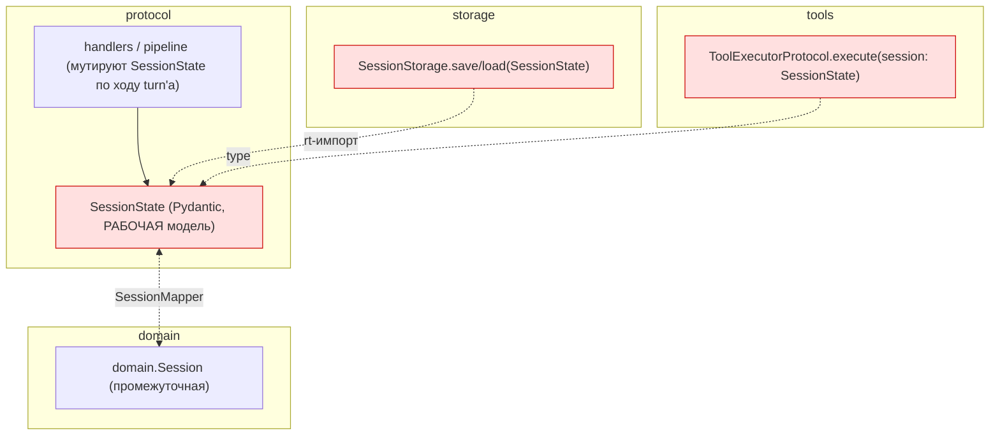
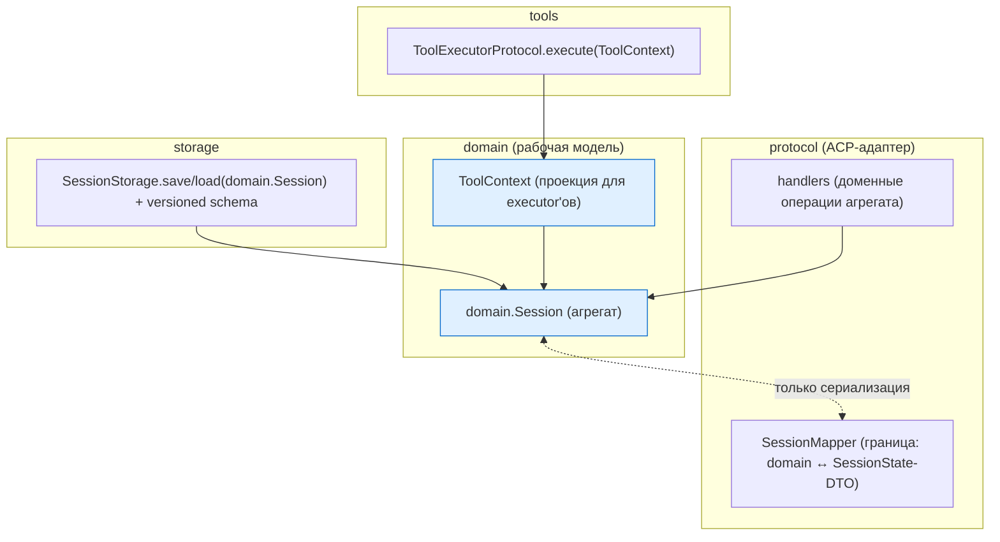

# Design: Write-фаза доменной миграции сессии

Технический дизайн эпика write-фазы (Workstream D плана ADR-005). Основание: ADR-006 (решение),
ADR-003 (вариант B), ADR-005 (read-фаза, порты).

## Принципы

1. `domain.Session` — рабочий агрегат; `SessionState` — сериализационный DTO на границе.
2. Единственная точка конвертации — `SessionMapper`; round-trip без потерь (гейт).
3. Изменение формата хранения — с миграцией (versioned schema, upgrade на чтении).
4. Wire `session/update` — байт-в-байт (golden-гейт перед любыми правками эмиссии).
5. Инкрементально, каждый шаг за `make check` + import-linter.

## Как сейчас (as-is)

## Как будет (to-be)

## Ключевые решения

### `SessionMapper` симметричность
Round-trip `domain.Session → SessionState → domain.Session` без потерь. Известная асимметрия —
схлопывание `MessageRole.TOOL → assistant` в `to_protocol`; довести до сохранения роли/tool_call_id.
Гейт: property-тест round-trip на репрезентативных сессиях (история с tool_calls, plan, multimodal).

### Формат хранения + миграция
`SessionStorage` сериализует `domain.Session`. Схема версионируется (`schema_version`); на чтении
старые версии (текущий `SessionState`-JSON) распознаются и апгрейдятся через `SessionMapper.to_domain`.
Существующие `~/.codelab/.../sessions` читаются без потерь; запись — в новом формате.

### `ToolContext`
Executor'ам нужна поверхность шире read-`SessionView`: `cwd`, permission-policy, `active_turn`,
client-RPC state. Вводится доменный `ToolContext` (проекция агрегата или сам агрегат), `ToolExecutorProtocol.execute`
ретайпится с него. `file_cache_decorator` использует его же → теряет `protocol.state`.

### Мутации по ходу turn-а
Хендлеры сейчас пишут в `SessionState.active_turn`/`history`/… напрямую. Переводятся на доменные
операции `domain.Session`. Это самая рискованная часть (горячий путь) — идёт по под-состояниям,
каждое за тестами поведения.

## Риски и решения

- **Горячий путь + мутации** — крупнейший риск; дробить по под-состояниям (`active_turn`, `history`,
  `tool_calls`, `plan`), byte-identity wire как страховка.
- **Миграция формата** — тесты на реальных старых сессиях; upgrade-путь обязателен.
- **`SessionMapper` на горячем пути** — стоимость конвертации; замерять, при необходимости —
  ленивые проекции.
- **Consumer-driven порты** — форму `AgentRunner`/`UpdateSink` доводит fake driver (Workstream E),
  не спекуляция.

## Вне области

- Прод turn-loop через `AgentRunner` (ADR-005 Workstream C) — после этого эпика.
- Доменная эмиссия `UpdateSink` (ADR-005 3.3/3.4, Workstream B) — после/параллельно C.
- Второй реальный драйвер (A2A) — отдельно; здесь только fake driver как потребитель.
