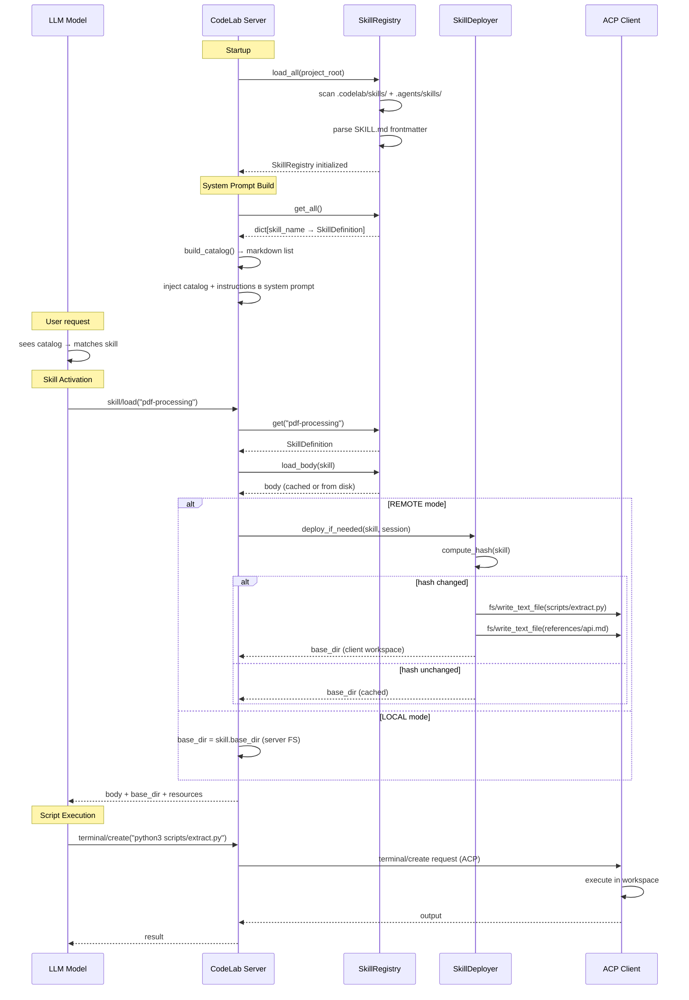

# Proposal: Поддержка системы Skills

## Почему

Агент не имеет механизма динамического подключения специализированных инструкций, шаблонов и документации. Пользователь вынужден вручную вставлять одни и те же инструкции в каждый промпт, что приводит к:
- повторению контекста
- расходу контекстного окна
- невозможности масштабирования до сотен навыков

**Решение**: Реализовать систему Skills, совместимую с открытым стандартом [Agent Skills](https://agentskills.io), с поддержкой progressive disclosure и lazy deploy в REMOTE режиме.

---

## Что изменяется

### Новые возможности

1. **Discovery навыков** — сканирование `.codelab/skills/` и `.agents/skills/` на сервере
2. **Skill Registry** — in-memory реестр всех зарегистрированных навыков
3. **Skill Catalog** — инъекция списка навыков в system prompt (markdown format)
4. **skill/load tool** — загрузка полного содержимого навыка по запросу модели
5. **Slash-команды** — прямой вызов навыков через `/skill-name`
6. **Lazy Deploy (REMOTE)** — деплой ресурсов навыков в workspace клиента через ACP
7. **Skill Cache** — кэширование body навыков для избежания повторного чтения

### Модификации

- `SystemPromptBuilder` — интеграция skill catalog между agent prompt и global prompt
- `ToolRegistry` — регистрация `skill/load` tool
- `SlashCommandRouter` — регистрация skills как `/skill-name` команд
- `AppConfig` — новая секция `[skills]` для конфигурации
- DI-контейнер — регистрация `SkillsProvider`

---

## Capabilities

### Новые capabilities

- **`skills-system`**: Discovery, registry, catalog, activation и deploy навыков. Включает:
  - Discovery: scan `.codelab/skills/` + `.agents/skills/` (project + user scopes)
  - Parse: YAML frontmatter + markdown body
  - Registry: in-memory storage с кэшированием body
  - Catalog: markdown list в system prompt
  - Activation: `skill/load` tool
  - Deploy: lazy deploy ресурсов в REMOTE режиме через ACP `fs/write_text_file`

### Модифицированные capabilities

- **`agent-config`**: Добавление секции `[skills]` в конфигурацию
- **`single-strategy`**: Интеграция skill catalog в формирование system prompt

---

## Влияние

### Затронутый код

| Слой | Компоненты | Изменения |
|------|------------|-----------|
| `server/skills/` | **НОВЫЙ МОДУЛЬ** | `models.py`, `exceptions.py`, `cache.py`, `loader.py`, `registry.py`, `catalog.py`, `deployer.py`, `tools.py` |
| `server/agent/` | `system_prompt_builder.py` | Добавление `skill_registry` параметра |
| `server/tools/` | `registry.py` | Регистрация `skill/load` tool |
| `server/config.py` | `AppConfig` | Новая секция `skills` |
| `server/di.py` | `SkillsProvider` | Регистрация новых компонентов |

### ACP-протокол

| Метод | Использование |
|-------|---------------|
| `session/new` | Получение `cwd` — для определения workspace в REMOTE режиме |
| `fs/write_text_file` | Deploy ресурсов навыков в REMOTE режиме |
| `fs/read_text_file` | Чтение ресурсов навыков моделью |
| `terminal/create` | Выполнение skill scripts на клиенте |

### Зависимости

- Новые зависимости: **нет** (используется стандартная библиотека `pathlib`, `hashlib`)
- Существующие: `ToolRegistry`, `SystemPromptBuilder`, `SlashCommandRouter`, `ClientRPCBridge` (для REMOTE deploy)

---

## Архитектура (Flow)

---

## LOCAL vs REMOTE режимы

| Аспект | LOCAL Mode | REMOTE Mode |
|--------|------------|-------------|
| Skills location | Server FS | Server FS |
| Discovery | `Path.glob()` на сервере | `Path.glob()` на сервере |
| Body reading | `Path.read_text()` на сервере | `Path.read_text()` на сервере |
| Resource deploy | **Не нужен** | **Lazy Deploy** через ACP |
| `base_dir` в ответе | Server FS path | `<workspace>/.codelab/skills-cache/<skill>/` |
| Script execution | На сервере (прямой доступ) | На клиенте через `terminal/create` |
| File operations | Прямой доступ | Через ACP `fs/*` |

---

## Security

### Trust Model

| Источник Skill | Trust Level | Deploy Behavior |
|----------------|-------------|-----------------|
| User skills (`~/.codelab/skills/`) | Trusted | Auto-deploy (без подтверждения) |
| Project skills (`.codelab/skills/`) | Untrusted | **Warn before deploy** |
| Project skills (`.agents/skills/`) | Untrusted | **Warn before deploy** |

### Path Traversal Protection

Все пути валидируются на предмет выхода за пределы skill directory.

### Hash-based Cache Invalidation

- Hash вычисляется для SKILL.md + всех ресурсов (SHA-256)
- При изменении любого файла → re-deploy
- Защита от stale cache

---

## Ограничения

| Аспект | Ограничение |
|--------|-------------|
| MAX_CATALOG_SKILLS | 100 (ограничение catalog в system prompt) |
| MAX_DESCRIPTION_LENGTH | 200 (truncation в catalog) |
| MAX_RESOURCE_SIZE | 500 KB (для одного файла) |
| MAX_TOTAL_RESOURCES | 100 (для одного skill) |
| MAX_DEPLOY_SIZE | 10 MB (суммарный размер) |

---

## Этапы реализации

| Фаза | Описание | Статус |
|------|----------|--------|
| **Phase 1 (Core)** | models, exceptions, cache, loader, registry | **Текущая** |
| Phase 2 (Activation) | catalog, tools, SystemPromptBuilder integration | — |
| Phase 3 (REMOTE) | deployer, REMOTE mode detection, deploy flow | — |
| Phase 4 (Polish) | Integration tests, performance tests, documentation | — |

---

## Критерии приёмки

1. Агент обнаруживает навыки из `.codelab/skills/` и `.agents/skills/` автоматически
2. SKILL.md body не загружается при старте (только frontmatter для catalog)
3. Навык загружается только по запросу модели через `skill/load`
4. Дополнительные файлы (scripts/, references/) перечисляются, но не загружаются автоматически
5. Одновременно поддерживается до 500 навыков в registry
6. Время discovery не более 100ms для 500 навыков
7. Добавление нового навыка не требует изменения кода агента
8. В REMOTE режиме ресурсы деплоятся в workspace клиента через ACP
9. Hash-based cache invalidation работает корректно
10. Slash-команды `/skill-name` работают для skills с `user_invocable=true`
11. `make check` проходит без ошибок
